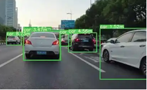
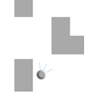
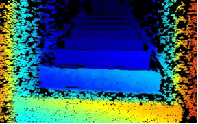
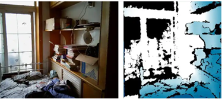
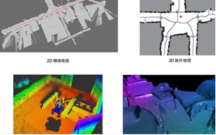
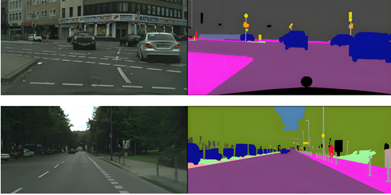
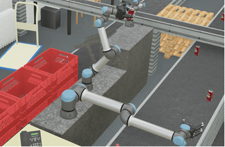

# Session 1 实验介绍

## 基础实验

### 1. 使用 YOLO 实现距离检测并警告前车距离

提示：建议使用 ultralytics YOLO 和 PyTorch 环境，使用 YOLOv10 模型对前方物体检测，并利用三角测距的原理，得出目标车辆或人至相机的距离。

> tag：计算机视觉、目标检测、单目测距（三角测距）、深度学习
>
> 难度：中等

### 2. 使用神经网络编写一个机器人预测碰撞的实验

提示：使用仿真环境 Webots 或 Pygame 构建机器人的运动场景，需要有多角度的测距传感器，然后利用 PyTorch 编写一个多层神经网络用来预测分类。

> tag：深度学习、多传感器测距融合、碰撞预测、仿真环境（Webots/Pygame）
>
> 难度：简单

### 3. 基于强化学习训练平衡杆的实验

提示：使用 Pygame 工具搭建 cart-pole 的仿真环境，并利用强化学习训练直立的杆子使其不倒，学习状态空间、动作空间、决策函数等概念的使用，可以尝试 DQN、Q-Learning 来完成训练。

> tag：强化学习、DQN/Q-Learning、经典控制（具身基本功）
>
> 难度：简单

### 4. 3D 点云重建三维场景的探索

提示：了解点云和深度图的关系，并掌握深度图到三维场景的转换原理，可以通过 RGBD 相机获取点云信息，也可以从附件中获取。

> tag：点云、深度图/RGBD、real-to-sim、场景建模（具身基本功）
>
> 难度：中等

### 5. 模仿学习（IL）的探索

了解模仿学习的原理，并总结其缺陷。

> tag：模仿学习、行为克隆
>
> 难度：简单

### 6. 2D-SLAM 建图与定位

了解建图的前端定位采集和后端建图优化的过程，可以从简单的 Gmapping、BreezySLAM 入手，也可以从 3D SLAM 入手（例如 FAST-LIO2 等），并尝试复现。

> tag：SLAM、建图与定位、前端里程计与后端优化
>
> 难度：困难

### 7. YOLO-Seg 用于可行驶区域的判断

提示：视觉导航的基础任务，可采集若干照片训练自定义的模型，然后用于分割道路。

> tag：深度学习、语义分割、视觉导航
>
> 难度：中等

### 8. 自动驾驶端到端的原理和实践

提示：参考英伟达端到端自动驾驶的论文，并使用 Webots 仿真环境实现。

> tag：自动驾驶、端到端学习、行为克隆、仿真（Webots）
>
> 难度：困难

### 9. 机械臂的逆向运动学解析与神经网络端到端实现方式

> tag：机械臂、逆运动学（IK）、神经网络端到端、具身基本思想
>
> 难度：简单

## 进阶实战项目

依托平台：可移动智能识别、抓取机器人；具身智能机械臂（双臂）。

### 1. 基于传统模块化的机器人建图、避障导航算法实战

基于上述无人车实现机器人基础算法，若无实体平台则使用仿真软件实现。

> tag：SLAM、路径规划、避障导航、传统模块化方案

### 2. 基于强化学习防碰撞的线控底盘模型设计

使用强化学习算法，给出目标点并结合 ANN 碰撞模型，设计一套端到端的多模态感知（雷达和视觉）与防碰撞网络架构 —— VOA（Vision-Other-Action）。效果不错的可以直接优化完善后投稿论文。

> tag：强化学习、多模态感知（视觉+雷达）、防碰撞、端到端架构

### 3. 基于 IK 逆运动学解析和 ANN 的 6 轴端到端网络抓取系统设计

使用机械臂并分析、推导逆运动学解析，实现逆运动学解析的开发；结合 ANN，融合 IMU、图像等开发出一套端到端的网络架构 —— VILA（Vision-IMU-Lidar-Action）模型。效果不错的可以直接优化完善后投稿论文。可以结合 PCA 主成分分析法作为改进或创新点，也可以加入 attention 机制。

> tag：机械臂、逆运动学（IK）、ANN、多传感器融合（视觉/IMU/雷达）、端到端抓取

### 4. 使用 SmolVLA 端到端控制机械臂实战

遥操数据采集 → 训练 → action 全流程。尝试修改 SmolVLA 的架构并完善算法，尝试替换算子结构，达到更灵活的抓取或提高动作速度。

> tag：SmolVLA、VLA 大模型、遥操作数据采集、端到端控制、机械臂抓取

### 5. 使用 ACT 端到端控制机械臂实战

遥操数据采集 → 训练 → action 全流程。尝试修改 ACT 的架构并完善算法，尝试替换算子结构，达到更灵活的抓取或提高动作速度。

> tag：ACT、模仿学习、遥操作数据采集、端到端控制、机械臂抓取

### 6. 双臂协同控制算法

研究现有的双臂协同控制算法，完善双臂协同算法，或者提出一套双臂协同架构 / 端到端控制算法，实现双臂联动、平滑顺滑的动作。

> tag：双臂协同、协同控制与规划、端到端控制、机械臂
