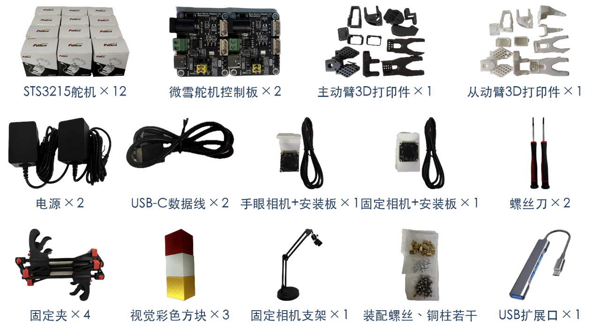
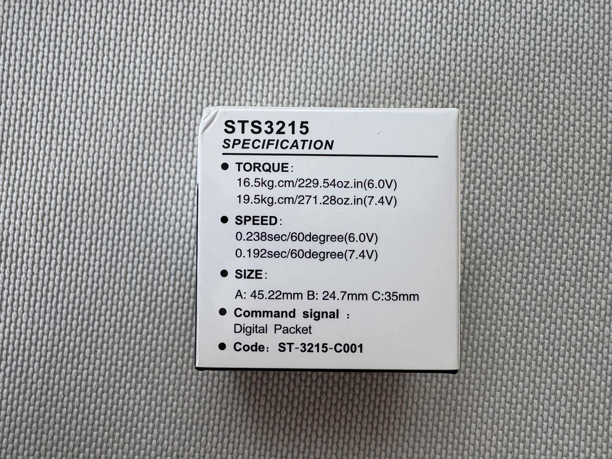
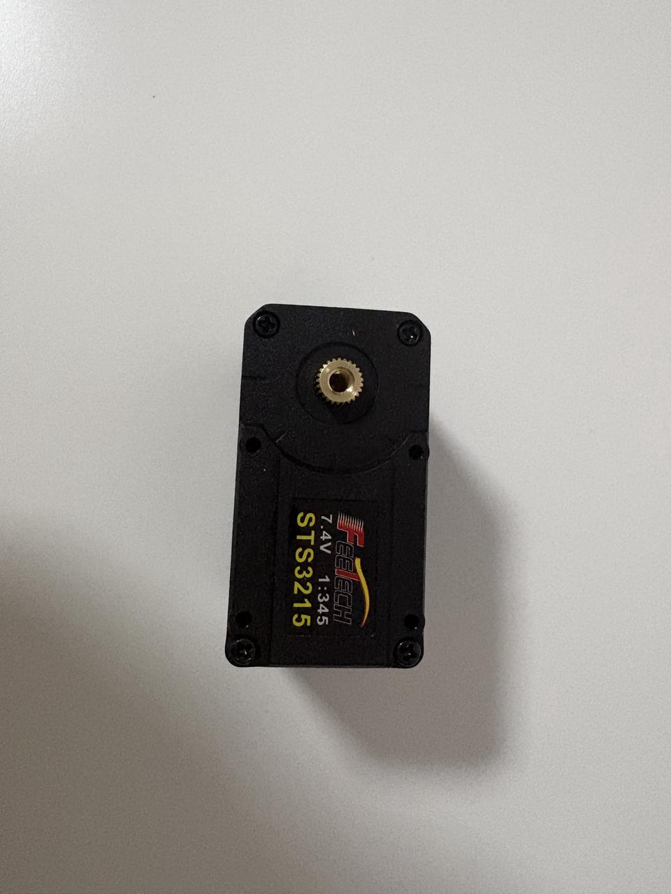
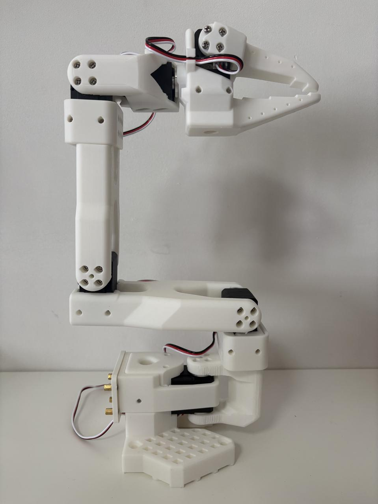
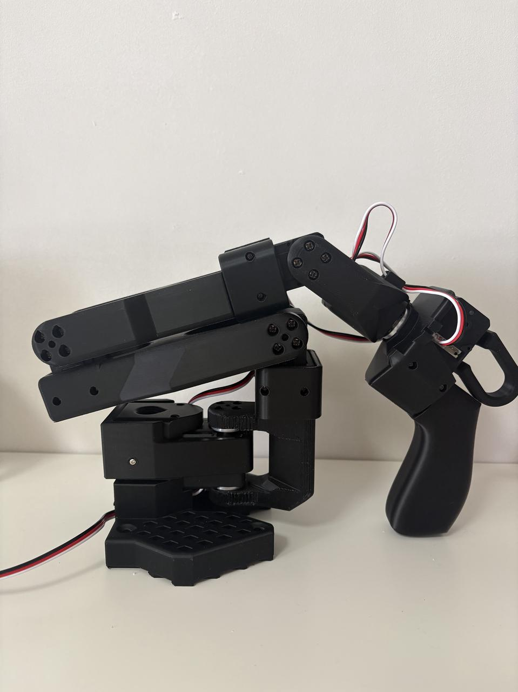
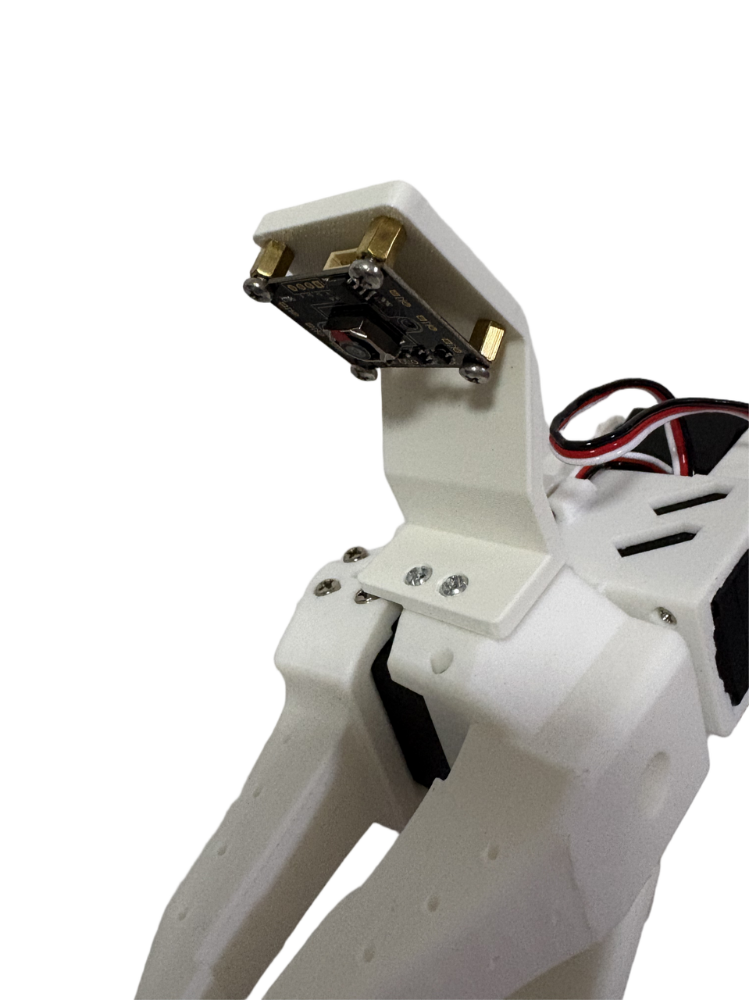
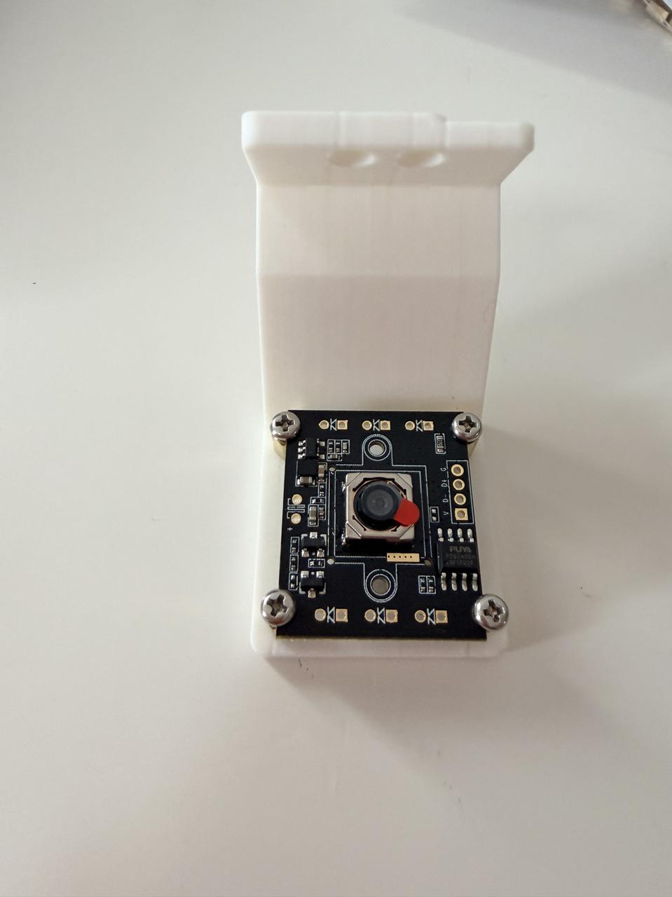

# lerobot-so101实操教程

> 来源：飞书知识空间（原文转录，非总结）

## 目录

- [一、概述与简介](#page-01)
  - [1.1 LeRobot 项目简介](#page-02)
  - [1.2 SO-101 机械臂简介](#page-03)
  - [1.3 硬件规格与选购渠道](#page-04)
- [二、硬件准备](#page-05)
  - [2.1 物料清单（BOM）](#page-06)
  - [2.2 3D 打印指南](#page-07)
  - [2.3 购买渠道](#page-08)
- [三、组装指南](#page-09)
  - [3.1 开箱清点](#page-10)
  - [3.2 认识与准备舵机](#page-11)
  - [3.3 舵机 ID 编号与中位校准](#page-12)
  - [3.4 组装从动臂（Follower Arm）](#page-13)
  - [3.5 组装主动臂（Leader Arm）](#page-14)
  - [3.6 相机安装和配置](#page-15)
  - [3.7 调试与验证](#page-16)
  - [3.8 附件代码](#page-17)
- [四、环境安装](#page-18)
  - [4.1 Mac 环境安装](#page-19)
  - [4.2 Ubuntu 环境安装](#page-20)
  - [4.3 Windows 环境安装](#page-21)
- [五、配置与校准](#page-22)
  - [5.1 查找串口设备端口号](#page-23)
  - [5.2 配置舵机 ID 与波特率](#page-24)
  - [5.3 运动范围标定](#page-25)
- [六、遥操作](#page-26)
  - [6.1 基础遥操作](#page-27)
  - [6.2 摄像头集成与遥操作](#page-28)
- [七、数据集](#page-29)
  - [7.1 采集数据集](#page-30)
  - [7.2 数据集管理工具](#page-31)
  - [7.3 HuggingFace 数据集上传与管理](#page-32)
- [八、模型训练](#page-33)
  - [8.1 训练概述与算法对比](#page-34)
  - [8.2 ACT 训练（推荐入门）](#page-35)
  - [8.3 SmolVLA 训练（推荐进阶）](#page-36)
  - [8.4 Diffusion Policy 训练](#page-37)
  - [8.5 Pi0 与 Pi0.5 训练（效果最优）](#page-38)
  - [8.6 云 GPU 训练环境配置](#page-39)
- [九、模型推理与部署](#page-40)
  - [9.1 推理命令说明](#page-41)
  - [9.2 各模型推理命令汇总](#page-42)
  - [9.3 Jetson Orin 部署](#page-43)
  - [9.4 GR00T N1.5 微调与 Jetson AGX Thor 部署](#page-44)
- [十、进阶应用](#page-45)
  - [10.1 XLeRobot 双臂移动平台](#page-46)
  - [10.2 LeKiwi 移动底盘](#page-47)
- [十一、故障排除](#page-48)
  - [11.1 常见问题与解决方案](#page-49)

<a id="page-01"></a>

## 一、概述与简介

原始页面：https://scnh0ytb81fx.feishu.cn/wiki/MBLswr5vmiUQwIkDj0ZcBVo4nQy

4月13日修改

本章节主要包含：

1. LeRobot项目简介

2. SO-101机械臂简介

3. 硬件规格与选购渠道

<a id="page-02"></a>

### 1.1 LeRobot 项目简介

原始页面：https://scnh0ytb81fx.feishu.cn/wiki/IPwKwiAGvi6kqyk4Z9ec0HfWn1b

7月18日修改

#### 1.1.1 概述

LeRobot 是由 Hugging Face 开源的面向真实世界机器人的机器学习框架，基于 PyTorch 构建。其核心目标是降低机器人技术的入门门槛，让每个人都能贡献并共享数据集和预训练模型。

---

#### 1.1.2 核心理念

LeRobot 聚焦于两大学习范式，均已在真实机器人上得到验证：

- 模仿学习（Imitation Learning）：通过人工示教采集数据，训练机器人模仿人类动作

- 强化学习（Reinforcement Learning）：通过与环境交互自主探索最优策略

---

#### 1.1.3 核心模块

##### 统一 Robot 接口

LeRobot 提供标准化的 Robot 类，支持多种硬件平台：

| 平台 | 类型 |
| --- | --- |
| SO-100 / SO-101 | 桌面机械臂 |
| LeKiwi | 移动底盘 |
| Koch | 机械臂 |
| HopeJR | 人形机器人 |
| EarthRover | 移动机器人 |
| Reachy2 | 双臂机器人 |
| Gamepad | 游戏手柄控制器 |

<a id="page-03"></a>

### 1.2 SO-101 机械臂简介

原始页面：https://scnh0ytb81fx.feishu.cn/wiki/MSo4wQlLMiGpdpkTdcrcitwPn5g

7月18日修改

#### 1.2.1 概述

SO-101 是由 The Robot Studio 与 Hugging Face 联合推出的新一代开源机械臂，在 SO-100 基础上全面升级，具备更好的走线方案、更易组装的结构和更新的电机配置，是目前最适合具身智能研究入门的低成本开源平台之一。

---

#### 1.2.2 SO-101 vs SO-100 改进对比

| 对比项 | SO-100 | SO-101 |
| --- | --- | --- |
| 走线方案 | 外露走线 | 内嵌走线，更整洁 |
| 组装难度 | 较高 | 降低，改进了连接件设计 |
| 电机型号 | STS3215 | STS3215（更新配置） |
| 文档支持 | 基础 | 完整，含视频教程 |
| 社区支持 | 一般 | 活跃，Discord 专属频道 |

---

#### 1.2.3 主从臂设计概念

SO-101 采用主从臂（Leader-Follower）遥操作架构：

```text
主动臂（Leader）  ──→  信号传输  ──→  从动臂（Follower）
人手持操控                          实际执行任务
```

- 从动臂（Follower Arm）：执行实际任务，安装在工作区域，带夹爪

- 主动臂（Leader Arm）：由人手持控制，电机轻量化设计便于操作

<a id="page-04"></a>

### 1.3 硬件规格与选购渠道

原始页面：https://scnh0ytb81fx.feishu.cn/wiki/AXQ6wCJCdi7Ztyk38SbcdRldnhe

昨天修改

#### 1.3.1 概述

本文详细列出 SO-101 的电机参数、套件构成和成本估算，帮助你在购买前做好充分了解。

---

#### 1.3.2 从动臂（Follower Arm）舵机配置

##### 方案一：较大负载

从动臂所有 6 个关节均使用相同型号电机，供电需要 12V：

| 关节编号 | 位置 | 电机型号 | 齿轮比 |
| --- | --- | --- | --- |
| 1 | 底座旋转 | STS3215-C018 | 1 / 345 |
| 2 | 肩部抬升 | STS3215-C018 | 1 / 345 |
| 3 | 肘部弯曲 | STS3215-C018 | 1 / 345 |
| 4 | 腕部弯曲 | STS3215-C018 | 1 / 345 |
| 5 | 腕部旋转 | STS3215-C018 | 1 / 345 |
| 6 | 夹爪 | STS3215-C018 | 1 / 345 |

> 从动臂使用统一的 STS3215-C018（12V），1/345 齿轮比提供足够扭矩完成精细操作任务。

以上是升级版的配置，如果将其退化到普通版，可以参考主动臂的舵机配置，跟其一样即可。

---

#### 1.3.3 主动臂（Leader Arm）舵机配置

主动臂为便于人手操控，不同关节采用不同齿轮比设计，平衡重力与操作手感。提供两种配置方案：

##### 方案一：标准配置（原版）

<a id="page-05"></a>

## 二、硬件准备

原始页面：https://scnh0ytb81fx.feishu.cn/wiki/ZrAlwBbAYiEX2Jkv9KScDl1Lnxg

4月13日修改

本章节主要包含：

1. 物料清单BOM

2. 3D打印指南

3. 购买渠道汇总

<a id="page-06"></a>

### 2.1 物料清单（BOM）

原始页面：https://scnh0ytb81fx.feishu.cn/wiki/V9NCwMIchirIQxkmOEwcTRIUntf

昨天修改

#### 2.1.1 概述

本文列出组装 SO-101 主从臂所需的全部零件清单，包含精确数量和规格说明，供采购参考。

---

#### 2.1.2 双臂套装 BOM（主动臂 + 从动臂）

##### 从动臂（Follower Arm）较大负载版本-舵机清单

从动臂所有 6 个关节均使用同一型号：

| 舵机型号 | 电压 | 齿轮比 | 额定扭矩 | 峰值扭矩 | 安装位置（ID） | 数量 |
| --- | --- | --- | --- | --- | --- | --- |
| STS3215-C018 | 4V～14V | 1:345 | 10kg·cm | 30kg·cm | ID1 底座、ID2 肩部、ID3 肘部、ID4 腕弯、ID5 腕旋、ID6 夹爪 | 6个 |

##### 从动臂（Follower Arm）中等负载版本-舵机清单

从动臂所有 6 个关节均使用同一型号：

| 舵机型号 | 电压 | 齿轮比 | 额定扭矩 | 峰值扭矩 | 安装位置（ID） | 数量 |
| --- | --- | --- | --- | --- | --- | --- |
| STS3215-C001 | 4V～7.4V | 1:345 | 5kg·cm | 19.5kg·cm | ID1 底座、ID2 肩部、ID3 肘部、ID4 腕弯、ID5 腕旋、ID6 夹爪 | 6个 |

---

##### 主动臂（Leader Arm）有阻尼版本-舵机清单

主动臂根据各关节所需扭矩，使用三种不同齿轮比的 7.4V 舵机：

<a id="page-07"></a>

### 2.2 3D 打印指南

原始页面：https://scnh0ytb81fx.feishu.cn/wiki/CRp7w9f5liBjcZkNRtrcJMSMnzi

7月27日修改

#### 2.2.1 概述

SO-101 的结构件均需要 3D 打印，本文提供推荐的打印参数和打印件清单，确保打印质量满足组装要求。

---

推荐打印参数

| 参数 | 推荐值 | 说明 |
| --- | --- | --- |
| 材料 | PLA Basic | 强度高，易打印 |
| 层高（0.4mm 喷嘴） | 0.2mm | 标准精度，平衡速度与质量 |
| 填充率 | 15% | 足够强度，节省材料 |
| 支撑 | 开启 | 忽略坡度 > 45° 的悬空部分 |
| 壁厚 | 推荐 3 层 | 提高结构强度 |
| 顶底层 | 4-5 层 | 增强表面质量 |

---

推荐打印机

官方提供了针对主流打印机的预配置切片文件：

| 打印机 | 支持情况 | 说明 |
| --- | --- | --- |
| Creality Ender 3 系列 | 官方预配置文件 | 最常见，社区支持最好 |
| Prusa i3/Mini | 官方预配置文件 | 高精度，推荐 |
| Up 打印机 | 官方预配置文件 | 适合工业场景 |
| 其他 FDM 打印机 | 参考参数自行切片 | 参照上表参数设置 |

启月科技 采用拓竹P2S打印机，亲测效果不错，有这款打印机的同学也可以尝试。自己打印成本相对更低。

<a id="page-08"></a>

### 2.3 购买渠道

原始页面：https://scnh0ytb81fx.feishu.cn/wiki/WCQTwy73aiIM6skawywcNTTunXf

7月18日修改

#### 2.3.1 概述

本文主要给出 SO-101 购买渠道，涵盖整机套件和散件采购两种方式。

---

#### 2.3.2 整机套件购买渠道

购买整机套件无需自行 3D 打印和采购零件，适合快速上手：

| 供应商 | 适用地区 | 特点 | 官网 |
| --- | --- | --- | --- |
| 启月科技（LumiMoon） | 国际/中国/美欧英澳 | 文档完善、有中文客服 | https://item.taobao.com/item.htm?ft=t&id=1051018401922&skuId=6081249372792&spm=a21dvs.23580594.0.0.4fee2c1bYZRrJv |
| PartaBot | 美国 | 美国本土发货，快速 | https://partabot.com |
| Autodiscovery | 欧洲 | 欧盟内发货 |  |

推荐中国用户：启月科技或矽递科技，有中文客服支持且售后方便。

---

#### 2.3.3 散件采购渠道

<a id="page-09"></a>

## 三、组装指南

原始页面：https://scnh0ytb81fx.feishu.cn/wiki/AntOwFZtxisjYOk1nJvcCcaqnmd

4月13日修改

本章节主要包含：

1. 开箱清点

2. 认识与准备舵机

3. 舵机中位校准

4. 组装从动臂

5. 组装主动臂

6. 调试与验证

7. 附件代码

<a id="page-10"></a>

### 3.1 开箱清点

原始页面：https://scnh0ytb81fx.feishu.cn/wiki/SZ7XwRpqRiqIuYkfyoFcuo1OnEc

7月18日修改

#### 3.1.1 概述

收到套件后，请按本文清单逐一核对零件，确保无遗漏或损坏，再开始组装。

---

#### 3.1.2 开箱检查流程

在干净平坦的桌面上开箱

2. 取出所有零件，按类别分组摆放

3. 对照下方清单逐一清点

4. 检查舵机外壳是否完好，连接线是否齐全

5. 如发现缺件或损坏，立即联系供应商

---

#### 3.1.3 整机套件清单（双臂）

整体零件全览（含电源、控制板、夹具、舵机、螺丝），以下是双相机版零件：



<a id="page-11"></a>

### 3.2 认识与准备舵机

原始页面：https://scnh0ytb81fx.feishu.cn/wiki/VxwJwsNzfiRN48kx04ocCewgnnh

7月26日修改

#### 3.2.1 概述

在组装机械臂之前，需要先完成舵机的基础认识、控制板接线和中位校准。这是组装中最关键的一步，舵机配置正确与否直接影响后续校准和遥操作效果。

---

#### 3.2.2 认识 STS3215 舵机

##### 外观结构

以C001舵机为例：

| 包装外观 | 内部外观 |
| --- | --- |
| 附件不支持打印 | 附件不支持打印 |





##### 关键特性

| 参数 | 值 |
| --- | --- |
| 型号 | STS3215（飞特舵机） |
|  |  |
|  |  |
|  |  |
|  |  |
|  |  |

<a id="page-12"></a>

### 3.3 舵机 ID 编号与中位校准

原始页面：https://scnh0ytb81fx.feishu.cn/wiki/ZYYEw6zhUi8zQxkdN7wcDMnrnZe

7月26日修改

#### 3.3.1 概述

本文是组装前必须完成的舵机底层配置，使用 Python 脚本完成以下两项操作：

1. ID 编号：将 12 个出厂默认 ID=1 的舵机依次编号为 ID 1～6（主从臂各一套）

2. 中位校准：将每个舵机的当前物理位置记录为零点（内部值 2048）

完成本文后，进行机械臂组装，再执行 [第四部分-配置与校准/3-校准机械臂]) 的运动范围标定。

与 4-1 的区别：本文使用 Python 脚本（无需 lerobot），适合 Mac 用户在安装 lerobot 之前操作。

> [4-配置与校准/1-配置舵机ID]是安装 lerobot 后的备用命令行方式。

---

#### 3.3.2 前置准备

##### 安装舵机 SDK

```bash
pip install feetech-servo-sdk -i https://pypi.tuna.tsinghua.edu.cn/simple/
```

##### 驱动安装

USB 串口适配器首次使用需安装驱动，安装后重启 Mac：

| 芯片 | 下载地址 |
| --- | --- |
| CH340 | wch.cn/downloads/CH341SER_MAC_ZIP.html |
|  |  |

<a id="page-13"></a>

### 3.4 组装从动臂（Follower Arm）

原始页面：https://scnh0ytb81fx.feishu.cn/wiki/YAujwDJ9yimEAykOwOyclgNunEe

7月27日修改



<a id="page-14"></a>

### 3.5 组装主动臂（Leader Arm）

原始页面：https://scnh0ytb81fx.feishu.cn/wiki/BcscwcZBmikH83kBLtfc43gYnlg

7月18日修改



<a id="page-15"></a>

### 3.6 相机安装和配置

原始页面：https://scnh0ytb81fx.feishu.cn/wiki/StSjwi2KHiOohKk5HBUckqL1nMh

7月18日修改

腕部相机安装示意图





<a id="page-16"></a>

### 3.7 调试与验证

原始页面：https://scnh0ytb81fx.feishu.cn/wiki/HSh7w7OMziHOapkmc4dcIFTlnNe

7月26日修改

#### 3.7.1 概述

机械臂组装完成后，需要进行系统性调试验证，确保所有关节运动正常、连线正确，才能进入校准和遥操作阶段。

---

#### 3.7.2 第一步：外观检查

##### 结构检查清单

- [ ] 所有螺丝已拧紧，无松动

- [ ] 所有 3D 打印件连接处无明显间隙

- [ ] 连接线走线整齐，无夹压风险

- [ ] 桌面夹已固定，机械臂底座稳定

##### 关节自由度检查

手动（断电状态下）缓慢活动每个关节：

| 关节 | 预期运动 | 运动范围参考 |
| --- | --- | --- |
| 关节 1（底座） | 左右旋转 | ±180° |
| 关节 2（肩部） | 前后抬升 | 0°~180° |
|  |  |  |
|  |  |  |
|  |  |  |
|  |  |  |

<a id="page-17"></a>

### 3.8 附件代码

原始页面：https://scnh0ytb81fx.feishu.cn/wiki/QXhIwKCPJiNDqkkPstlc1yeZnch

> [!WARNING]
> 此页面正文未能读取：浏览器安全策略阻止了滚动或正文提取。

<a id="page-18"></a>

## 四、环境安装

原始页面：https://scnh0ytb81fx.feishu.cn/wiki/YaCmwndtaiJuOhkj8nGcVS92nah

4月16日修改

本章节主要包含：

1. Mac环境安装

2. ubuntu环境安装

3. windows环境安装

<a id="page-19"></a>

### 4.1 Mac 环境安装

原始页面：https://scnh0ytb81fx.feishu.cn/wiki/LFZtwZnH2iflC5kdHKzcIczjnig

7月18日修改

#### 4.1.1 概述

本文介绍在 macOS 系统上安装 LeRobot 及 SO-101 所需全部依赖的步骤，包括 Python 环境、LeRobot 框架和飞特舵机 SDK。

---

#### 4.1.2 系统要求

| 项目 | 要求 |
| --- | --- |
| macOS 版本 | 12 Monterey 及以上 |
| Python 版本 | 3.12 及以上（lerobot 最新版要求） |
| 磁盘空间 | ≥ 10GB（含依赖和数据集） |
| 内存 | ≥ 8GB（16GB 推荐） |

注意：Mac 不支持 NVIDIA GPU，因此 Mac 适合用于遥操作和数据采集，不适合本地训练模型（训练需要 Linux + NVIDIA GPU）。

---

#### 4.1.3 安装步骤

<a id="page-20"></a>

### 4.2 Ubuntu 环境安装

原始页面：https://scnh0ytb81fx.feishu.cn/wiki/RVeqwfABAiXF8PktGU1cIywQn3c

7月18日修改

#### 4.2.1 概述

Ubuntu 是运行 LeRobot 的推荐系统，支持 NVIDIA GPU 加速训练，是数据采集和模型训练的首选平台。本文涵盖从 Python 环境到 CUDA 的完整安装流程。

---

#### 4.2.2 系统要求

| 项目 | 要求 |
| --- | --- |
| Ubuntu 版本 | 20.04 LTS 或 22.04 LTS（推荐） |

| Python 版本 | 3.12 及以上（lerobot 最新版要求） |

| NVIDIA 驱动 | ≥ 520（训练时需要） |

| CUDA 版本 | 11.8 或 12.1（与 PyTorch 版本对应） |

| GPU 显存 | ≥ 8GB（ACT/Diffusion）；≥ 24GB（Pi0/GR00T） |

| 磁盘空间 | ≥ 50GB |

---

#### 4.2.3 安装步骤

##### 第一步：安装 Python 环境

<a id="page-21"></a>

### 4.3 Windows 环境安装

原始页面：https://scnh0ytb81fx.feishu.cn/wiki/JVYoweRChiIHVck8HU7cBhojngc

7月18日修改

##### 4.3.1 概述

Windows 用户可以通过 WSL2（Windows Subsystem for Linux）运行 LeRobot，本文介绍 WSL2 的配置方式以及 Windows 原生安装的注意事项。

---

#### 4.3.2 WSL2简介

##### WSL2（Windows Subsystem for Linux）

由于 LeRobot 对 Linux 支持最完善，强烈推荐 Windows 用户使用 WSL2 运行 LeRobot，而不是直接在 Windows 原生环境安装。

##### WSL2 vs 原生 Windows 对比

| 方面 | WSL2 | 原生 Windows |
| --- | --- | --- |
| 兼容性 | 优秀，接近原生 Linux | 部分依赖不支持 |
| 串口访问 | 需要额外配置 | 原生支持 |
| GPU 训练 | 支持（通过 WSLg） | 支持 |
| 推荐度 | ★★★★★ | ★★★ |

---

<a id="page-22"></a>

## 五、配置与校准

原始页面：https://scnh0ytb81fx.feishu.cn/wiki/QkxlwUnjtiMmcJkf3mLcc4MInAg

4月17日修改

本章节主要包含：

1. 查找串口设备端口号

2. 配置舵机ID与波特率

3. 校准机械臂

<a id="page-23"></a>

### 5.1 查找串口设备端口号

原始页面：https://scnh0ytb81fx.feishu.cn/wiki/R1DNwFe5nipX8QkqxXJc4do9nZb

7月18日修改

#### 5.1.1 概述

在运行任何 LeRobot 命令前，需要先确定控制板对应的串口端口号，并分别识别主动臂和从动臂各自连接的端口。

---

#### 5.1.2 使用 LeRobot 自动识别工具

LeRobot 提供了专用工具，通过"插拔对比法"自动识别端口：

```bash
lerobot-find-port
```

###### 操作步骤

```text
1. 运行命令后，程序列出当前所有可用串口

2. 按提示拔掉控制板的 USB 线，按 Enter

3. 程序对比前后差异，确定该控制板的端口号
```

<a id="page-24"></a>

### 5.2 配置舵机 ID 与波特率

原始页面：https://scnh0ytb81fx.feishu.cn/wiki/RJF3wqk6OiQIv6kwNGCc8wNonbf

7月26日修改

#### 5.2.1 概述

本文介绍使用 LeRobot 内置命令 lerobot-setup-motors 配置舵机 ID 的方法，适用于已完成 lerobot 安装的用户。

如果尚未安装 lerobot，请优先参考

> [3-组装指南/3-舵机ID编号与中位校准](../3-组装指南/3-舵机中位校准.md)（Python 脚本方式，亲测可用）。

---

#### 5.2.2 前提条件

- [ ] 已完成 LeRobot 安装

- [ ] 已找到串口端口号

- [ ] 控制板跳线帽已设置在 B 通道（USB 模式）

- [ ] 每次总线上只连接一个舵机

---

#### 5.2.3 配置从动臂舵机

```bash
lerobot-setup-motors \
```

<a id="page-25"></a>

### 5.3 运动范围标定

原始页面：https://scnh0ytb81fx.feishu.cn/wiki/Dx44wVDxmiCYr0kWP2WcMYlKnpc

7月28日修改

#### 5.3.1 概述

校准是将机械臂各关节的物理位置与软件坐标系对齐的过程。只有正确校准后，主动臂才能准确控制从动臂，且训练出的神经网络才能在不同机器人之间迁移。【3.3 舵机ID编号与中位校准】中所述的中位校准，和本节所述的运动范围标定，都是属于校准过程。

---

#### 5.3.2 前提条件

在运行本文命令前，须已完成：

- [ ] 舵机 ID 编号（1-6）

- [ ] 机械臂已组装完成，全部 6 个舵机串联接入

- [ ] 串口端口号已确认

---

#### 5.3.3 校准从动臂

##### 启动lerobot

<a id="page-26"></a>

## 六、遥操作

原始页面：https://scnh0ytb81fx.feishu.cn/wiki/Bsw2wNKOWicqh5kQLlrcfuEJnjh

本章节主要包含：

1. 基础遥操作

2. 摄像头集成与遥操作

<a id="page-27"></a>

### 6.1 基础遥操作

原始页面：https://scnh0ytb81fx.feishu.cn/wiki/RuOywnJbAix40GkBQgzca1oCnie

7月18日修改

#### 6.1.1 概述

遥操作（Teleoperation）是通过操控主动臂来实时控制从动臂的技术，是数据采集的核心环节。本文介绍无摄像头的基础遥操作启动方式。

---

#### 6.1.2 前提条件

- [ ] 已完成主从臂组装

- [ ] 已完成舵机 ID 配置

- [ ] 已完成机械臂校准

- [ ] 已知主从臂各自的串口端口号

- [ ] LeRobot 已安装（pip install -e ".[feetech]"）

---

#### 6.1.3 遥操作命令

以下命令中串口号均需要替换成自己实际的串口号

##### macOS

```bash
conda activate lerobot

lerobot-teleoperate \
--robot.type=so101_follower \
--robot.port=/dev/cu.usbmodem58760431551 \
--teleop.type=so101_leader \
--teleop.port=/dev/cu.usbmodem575E0031751
```

退出遥操作时，直接按control+c

##### Linux（Ubuntu）

```bash
conda activate lerobot

lerobot-teleoperate \
--robot.type=so101_follower \
--robot.port=/dev/ttyACM0 \
--teleop.type=so101_leader \
--teleop.port=/dev/ttyACM1
```

##### Windows（WSL）

```bash
# 在 WSL2 终端中运行
conda activate lerobot

lerobot-teleoperate \
--robot.type=so101_follower \
--robot.port=/dev/ttyACM0 \
--teleop.type=so101_leader \
--teleop.port=/dev/ttyACM1
```

---

#### 6.1.4 参数说明

| 参数 | 说明 | 示例 |
| --- | --- | --- |
| --robot.type | 从动臂类型 | so101_follower |
| --robot.port | 从动臂串口端口 | /dev/ttyACM0 |
| --teleop.type | 主动臂类型 | so101_leader |
| --teleop.port | 主动臂串口端口 | /dev/ttyACM1 |
| --display_data | 显示实时数据（可选） | --display_data |

---

#### 6.1.5 遥操作启动后

程序启动后：

1. 从动臂会移动到当前主动臂位置 - 请确保周围无障碍物

2. 实时同步：缓慢移动主动臂，从动臂会同步跟随

3. 退出：按 `Ctrl+C` 停止遥操作

```text
终端输出示例：
Connected to follower arm at /dev/ttyACM0
Connected to leader arm at /dev/ttyACM1
Calibration loaded.
Teleoperation started. Press Ctrl+C to stop.
[00:00:01] Position: base=0.0°, shoulder=45.2°, elbow=-32.1°, ...
```

---

#### 6.1.6 安全操作规范

> ⚠️ 首次遥操作注意事项

1. 先小范围测试：首次遥操作只做小幅度动作（±5°），确认响应正常后再做大幅度动作

2. 保持安全距离：从动臂工作区域内不要放置易碎物品或手

3. 避免超出范围：不要把主动臂强行移到极限位置，可能导致从动臂电机堵转

4. 缓慢操作：动作过快会导致从动臂追不上，产生抖动甚至报错

5. 停止前归位：在按 `Ctrl+C` 前，先将主动臂缓慢移回零位

---

#### 6.1.7 遥操作质量优化

##### 减少延迟

```bash
# 增加控制频率（默认 30Hz，可尝试提高）
lerobot-teleoperate \
--robot.type=so101_follower \
--robot.port=/dev/ttyACM0 \
--teleop.type=so101_leader \
--teleop.port=/dev/ttyACM1 \
--control_hz=50
```

##### 调整运动平滑度

主动臂移动过快时，从动臂可能产生震荡。适当减慢操作速度或增加阻尼参数可改善效果。

---

#### 6.1.8 遥操作数据可视化

运行时添加 --display_data 参数可以看到实时关节位置数据：

```bash
lerobot-teleoperate \
--robot.type=so101_follower \
--robot.port=/dev/ttyACM0 \
--teleop.type=so101_leader \
--teleop.port=/dev/ttyACM1 \
--display_data
```

---

#### 6.1.9 仿真遥操作（LeIsaac）

如果没有真实机械臂，可以通过光轮智能 LeIsaac 仿真平台进行虚拟遥操作，参考网站：https://lightwheelai.github.io/leisaac

- 在仿真环境中采集的数据集格式与真实机械臂完全兼容

- 适合在购买硬件前验证算法效果

---

#### 参考资料

- HuggingFace LeRobot 官方文档

<a id="page-28"></a>

### 6.2 摄像头集成与遥操作

原始页面：https://scnh0ytb81fx.feishu.cn/wiki/TYOYwxWTCiBhjBkVtkxccuhanUe

> [!WARNING]
> 此页面正文未能读取：浏览器安全策略阻止了滚动或正文提取。

<a id="page-29"></a>

## 七、数据集

原始页面：https://scnh0ytb81fx.feishu.cn/wiki/GNgswoboRiBdZmkJ0sKceeuynFe

4月16日修改

本章节主要包含：

1. 采集数据集

2. 数据集管理工具

3. HuggingFace数据集上传与管理

<a id="page-30"></a>

### 7.1 采集数据集

原始页面：https://scnh0ytb81fx.feishu.cn/wiki/BMe2wxFpxiFACZk7nXic93bsnZb

7月18日修改

#### 7.1.1 概述

数据集采集是模仿学习的核心步骤。通过遥操作主动臂执行任务，系统同步记录关节角度和摄像头图像，形成用于训练模型的示教数据集。

---

#### 7.1.2 数据集格式

LeRobot 采用统一的数据集格式：

```text
└── videos/
    └── chunk-000/
        ├── observation.images.overhead_episode_000000.mp4
        ├── observation.images.wrist_episode_000000.mp4
        └── ...
```

---

#### 7.1.3 采集命令

##### 基础采集命令

```bash
    --teleop.type=so101_leader \
    --teleop.port=/dev/ttyACM1 \
    --dataset.repo_id=YOUR_HF_USERNAME/my_dataset \
    --dataset.num_episodes=50 \
    --dataset.single_task="从桌子左侧拾取红色积木并放置到右侧"
```

##### 带摄像头的采集命令（推荐）

```bash

```

##### 本地保存（不上传 HuggingFace）

```bash
lerobot-record \
    --robot.type=so101_follower \
    --robot.port=/dev/ttyACM0 \
    --teleop.type=so101_leader \
    --teleop.port=/dev/ttyACM1 \
    --dataset.repo_id=local/my_dataset \
    --dataset.num_episodes=50 \
    --dataset.single_task="任务描述" \
    --dataset.push_to_hub=false
```

---

#### 7.1.4 关键参数说明

```text
参数

说明

推荐值

--dataset.repo_id

数据集 ID（用户名/数据集名）

自定义

--dataset.num_episodes

总采集次数（episode 数）

50-200

--dataset.single_task

任务描述（中文或英文均可）

简洁描述

--dataset.fps

录制帧率

60

--dataset.push_to_hub

是否上传 HuggingFace

true / false
```

---

#### 7.1.5 采集流程

##### 单次 Episode 流程

```text
1. 程序提示"准备好后按 Enter 开始录制..."
   ↓
2. 按 Enter，录制开始
   ↓
3. 操控主动臂执行完整任务（约 3-15 秒）
   ↓
4. 任务完成后，程序自动进入"重置"环节
   ↓
5. 将场景（积木位置等）重置到初始状态
   ↓
6. 按 Enter，开始下一次录制
```

##### 快捷键控制

```text
Enter

开始/确认录制

→（右箭头）

保存当前 episode，继续下一个

←（左箭头）

丢弃当前 episode，重新录制

q

退出录制（保存已采集的数据）
```

---

#### 7.1.6 数据采集质量指南

##### 建议采集数量

```text
简单（固定位置拾取）

50-100

入门任务

中等（动态目标）

100-200

标准任务

复杂（多步骤操作）

200-500

需要更多数据
```

##### 提升数据质量的建议

1. 保持一致性：每次 episode 的起始状态尽量相同

2. 动作流畅：避免频繁停顿或抖动，动作要连贯自然

3. 任务完整：每个 episode 都完整执行完任务（包括最终状态）

4. 适当多样性：可以从略微不同的初始位置执行任务，增加泛化性

5. 光照稳定：整个采集过程中保持相同光线条件

##### 采集环境设置

```text
推荐工作区域布置：

    [顶置摄像头]（俯视整个工作台）

    ┌─────────────────────────────┐
    │  任务目标区（固定区域）         │
    │  ○ 积木/物体放置区域           │
    │                             │
    │  从动臂工作范围               │
    └─────────────────────────────┘

注意：
- 背景尽量简洁，避免反光
- 工作台面颜色与任务目标有明显区分
- 固定所有不参与任务的物体
```

---

#### 7.1.7 示例：采集 200 次握手数据集

```bash
# 示例任务：机械臂"握手"动作
lerobot-record \
    --robot.type=so101_follower \
    --robot.port=/dev/ttyACM0 \
    --teleop.type=so101_leader \
    --teleop.port=/dev/ttyACM1 \
    --robot.cameras='{
        "overhead": {"type": "opencv", "index_or_path": 0, "fps": 60, "width": 640, "height": 480}
    }' \
    --dataset.repo_id=YOUR_HF_USERNAME/handshake_200 \
    --dataset.num_episodes=200 \
    --dataset.single_task="机械臂执行握手动作"
```

---

#### 7.1.8 回看与回放数据集

##### 查看已采集的数据

```bash
# 在线可视化（HuggingFace 数据集页面）
# 将数据集上传后，在 HuggingFace 数据集页面可直接查看视频

# 本地可视化
lerobot-dataset-viz --repo_id local/my_dataset
```

##### 回放单个 Episode

```bash
# 回放第一个 episode
lerobot-replay \
    --robot.type=so101_follower \
    --robot.port=/dev/ttyACM0 \
    --dataset.repo_id=local/my_dataset \
    --dataset.episode=0
```

---

#### 参考资料

- HuggingFace LeRobot 数据集文档

<a id="page-31"></a>

### 7.2 数据集管理工具

原始页面：https://scnh0ytb81fx.feishu.cn/wiki/PwzIwCp9LieXcGkVk5Sc68wnnFf

7月18日修改

#### 7.2.1 概述

LeRobot 提供了一套完整的数据集管理工具（lerobot-edit-dataset），支持删除、分割、合并、特征过滤和格式转换等操作，方便对采集的数据集进行后处理。

---

#### 7.2.2 工具说明

```bash
git clone https://github.com/huggingface/lerobot
cd lerobot
pip install -e ".[feetech]"
```

官方文档参考：[HuggingFace 数据集工具文档](https://huggingface.co/docs/lerobot/using_dataset_tools)

---

##### 删除特定 Episodes

采集时如果某些 episode 质量不佳（机械臂抖动、任务失败），可以删除：

```bash
lerobot-edit-dataset \
    --repo_id YOUR_HF_USERNAME/my_dataset \
    --operation.type delete_episodes \
    --operation.episode_indices "[3, 7, 15]"   # 删除第 3、7、15 个 episode（从 0 开始计数）
```

###### 参数说明

```text
--operation.episode_indices

要删除的 episode 编号列表
```

---

##### 分割数据集

将一个大数据集按比例或按指定索引分割为训练集/测试集：

###### 按比例分割

```bash
lerobot-edit-dataset \
    --repo_id YOUR_HF_USERNAME/my_dataset \
    --operation.type split_dataset \
    --operation.train_fraction 0.8   # 80% 训练集，20% 测试集
```

###### 按指定 episode 分割

```bash
lerobot-edit-dataset \
    --repo_id YOUR_HF_USERNAME/my_dataset \
    --operation.type split_dataset \
    --operation.split_indices "[0, 40]"   # 前 40 个 episode 为训练集
```

---

##### 合并多个数据集

将多次采集的数据集合并为一个：

```bash
lerobot-edit-dataset \
    --repo_id YOUR_HF_USERNAME/merged_dataset \
    --operation.type merge_datasets \
    --operation.source_repo_ids '["user/dataset_a", "user/dataset_b", "user/dataset_c"]'
```

使用场景：

- 分批采集数据后合并

- 合并不同日期采集的数据集

- 合并不同初始位置的数据集以增加多样性

---

##### 删除特定特征（摄像头/数据通道）

如果数据集中某个摄像头质量不佳或不需要，可以单独删除：

```bash
    --repo_id YOUR_HF_USERNAME/my_dataset \
    --operation.type remove_features \
    --operation.features_to_remove '["observation.images.wrist"]'

# 删除多个特征
lerobot-edit-dataset \
    --repo_id YOUR_HF_USERNAME/my_dataset \
    --operation.type remove_features \
    --operation.features_to_remove '["observation.images.overhead", "observation.depth"]'
```

---

##### 图像转视频压缩

将帧式图像数据集转换为 MP4 视频格式，大幅减少存储空间：

```bash
    --operation.fps 60
```

压缩效果参考：

- 图像格式（PNG）：100 个 episode × 60fps × 640×480 ≈ 5-10 GB

- 视频格式（MP4）：同等内容 ≈ 0.5-2 GB（约减少 90%）

---

##### 数据集可视化

###### 在线可视化（HuggingFace）

上传到 HuggingFace 后，可以在数据集页面直接查看视频回放：

```text
https://huggingface.co/datasets/YOUR_HF_USERNAME/my_dataset
```

###### 本地可视化

```bash
# 启动本地可视化工具
lerobot-dataset-viz \
    --repo_id YOUR_HF_USERNAME/my_dataset \
    --episode 0   # 查看第 0 个 episode
```

###### 命令行查看数据集信息

```bash
print(f'总帧数: {len(dataset)}')
print(f'摄像头: {list(dataset.meta.camera_keys)}')
print(f'关节: {dataset.meta.motor_names}')
"
```

---

#### 7.2.3 数据集质量检查

在训练前建议进行以下质量检查：

```bash
# 1. 统计各 episode 的帧数（帧数异常说明录制出问题）
python -c "
from lerobot.common.datasets.lerobot_dataset import LeRobotDataset
dataset = LeRobotDataset('local/my_dataset')
for i in range(dataset.num_episodes):
    ep_data = dataset.hf_dataset.filter(lambda x: x['episode_index'] == i)
    print(f'Episode {i}: {len(ep_data)} 帧')
"

# 2. 可视化前 5 个 episode 抽查质量
for i in $(seq 0 4); do
    lerobot-dataset-viz --repo_id local/my_dataset --episode $i
done
```

---

#### 参考资料

- HuggingFace 数据集工具官方文档

<a id="page-32"></a>

### 7.3 HuggingFace 数据集上传与管理

原始页面：https://scnh0ytb81fx.feishu.cn/wiki/SaeQw1WQCixeDAkUJcucp3wwnBe

7月18日修改

#### 7.3.1 概述

将数据集上传到 HuggingFace Hub 后，可以在云端存储和版本管理，并与社区分享，同时也便于在云 GPU 服务器上直接拉取训练。

---

#### 7.3.2 注册 HuggingFace 账号

1. 访问 huggingface.co 注册免费账号

2. 进入账号设置，创建访问令牌（Access Token）：
◦
地址：https://huggingface.co/settings/tokens

- 类型选择 Write（写入权限）

- 复制保存 Token

---

#### 7.3.3 配置本地 HuggingFace 登录

```bash
# 安装 huggingface_hub
pip install huggingface_hub

# 登录（输入 Token 后按 Enter）
huggingface-cli login
# 或
python -c "from huggingface_hub import login; login()"
```

验证登录：

```bash
huggingface-cli whoami
# 输出用户名说明登录成功
```

---

#### 7.3.4 采集时直接上传

在 lerobot-record 命令中加入 HuggingFace 账号信息即可自动上传：

```bash
lerobot-record \
    --robot.type=so101_follower \
    --robot.port=/dev/ttyACM0 \
    --teleop.type=so101_leader \
    --teleop.port=/dev/ttyACM1 \
    --dataset.repo_id=YOUR_HF_USERNAME/my_dataset \   # 替换为你的 HuggingFace 用户名
    --dataset.num_episodes=50 \
    --dataset.single_task="任务描述" \
    --dataset.push_to_hub=true    # 采集完成后自动上传
```

---

#### 7.3.5 手动上传已有数据集

如果已有本地数据集，可以手动上传：

```bash
python -c "
from lerobot.common.datasets.lerobot_dataset import LeRobotDataset
dataset = LeRobotDataset('local/my_dataset')
dataset.push_to_hub(repo_id='YOUR_HF_USERNAME/my_dataset', private=False)
print('上传完成！')
"
```

---

#### 7.3.6 数据集命名规范

```text
用户名/任务

username/task_description

amy/pick_and_place

包含数量

加入 episode 数

amy/pick_and_place_100eps

包含硬件信息

加入机器人型号

amy/so101_pick_and_place
```

---

#### 7.3.7 数据集格式说明

上传的 LeRobot 数据集包含以下结构：

```text
│   └── chunk-000/
│       ├── episode_000000.parquet   # 时间序列数据（关节角度、时间戳）
│       └── ...
└── videos/
    └── chunk-000/
        ├── observation.images.overhead_episode_000000.mp4
        └── observation.images.wrist_episode_000000.mp4
```

Parquet 文件内容示例：

```text
字段

说明

timestamp

时间戳（秒）

observation.state

关节角度（6维向量）

action

动作指令（6维向量）

episode_index

episode 编号

frame_index

帧编号
```

---

#### 7.3.8 从 HuggingFace 下载数据集

```python
from lerobot.common.datasets.lerobot_dataset import LeRobotDataset

# 下载并加载数据集
dataset = LeRobotDataset("lerobot/aloha_mobile_cabinet")

# 查看数据集信息
print(f"Episodes: {dataset.num_episodes}")
print(f"Total frames: {len(dataset)}")
print(f"Robot type: {dataset.meta.robot_type}")

# 访问某一帧数据
frame = dataset[0]
print(frame.keys())  # dict_keys(['observation', 'action', ...])
```

---

#### 7.3.9 查看社区公开数据集

LeRobot 社区提供了大量公开数据集：

```python
# 搜索 SO-101 相关数据集
from huggingface_hub import HfApi
api = HfApi()
datasets = api.list_datasets(search="so101", task_categories=["robotics"])
for ds in datasets:
    print(ds.id)
```

推荐公开数据集：

- lerobot - HuggingFace 官方数据集合集

- 社区成员分享的 SO-101 数据集（在 HuggingFace 搜索 so101）

---

#### 7.3.10 数据集版本管理

HuggingFace Hub 使用 Git LFS 进行版本管理：

```bash
# 查看数据集历史版本
huggingface-cli repo-info YOUR_HF_USERNAME/my_dataset

# 下载特定版本
dataset = LeRobotDataset(
    "YOUR_HF_USERNAME/my_dataset",
    revision="v1.0"  # 指定版本号
)
```

---

#### 参考资料

- HuggingFace Hub 文档

- LeRobot 数据集官方文档

<a id="page-33"></a>

## 八、模型训练

原始页面：https://scnh0ytb81fx.feishu.cn/wiki/YCoHwZtVIiaGe0kQdtYcxNDOnQf

4月16日修改

本章节主要包含：

1. 训练概述与算法对比

2. ACT 训练（推荐入门）

3. SmolVLA 训练（推荐进阶）

4. Diffusion Policy 训练

5. Pi0 与 Pi0.5 训练（效果最优）

6. 云 GPU 训练环境配置

<a id="page-34"></a>

### 8.1 训练概述与算法对比

原始页面：https://scnh0ytb81fx.feishu.cn/wiki/YEhXwFMIliT1aSk5Wq7cpGosnuh

7月18日修改

#### 8.1.1 概述

LeRobot 支持多种主流机器人学习算法，本文对各算法进行横向对比，帮助你选择适合自己任务和硬件条件的训练方案。

---

#### 8.1.2 算法分类体系

```text
LeRobot 支持的算法
├── 模仿学习（Imitation Learning）
│   ├── ACT（Action Chunking with Transformers）
│   ├── Diffusion Policy（扩散策略）
│   └── VQ-BeT（矢量量化行为变换器）
│
├── 强化学习（Reinforcement Learning）
│   ├── HIL-SERL（人在回路强化学习）
│   └── TDMPC（基于模型的规划）
│
└── 视觉-语言-动作模型（VLA）
    ├── SmolVLA（轻量级，进阶推荐）
    ├── Pi0（效果优秀）
    ├── Pi0.5（Pi0 升级版）
    ├── GR00T N1.5（NVIDIA，Jetson 优化）
    └── WALL-OSS（国产开源）
```

<a id="page-35"></a>

### 8.2 ACT 训练（推荐入门）

原始页面：https://scnh0ytb81fx.feishu.cn/wiki/WcROwqCuni2BY4kgAclcFD6XnYd

7月18日修改

#### 8.2.1 概述

ACT（Action Chunking with Transformers）是 LeRobot 中最推荐入门的算法，训练稳定、显存需求低（8GB 可用），是大多数 SO-101 场景的首选方案。

---

#### 8.2.2 算法背景

- 论文：[Learning Fine-Grained Bimanual Manipulation with Low-Cost Hardware (2023)](https://arxiv.org/abs/2304.13705)

- 核心创新：将未来一段时间内的动作（Chunk）作为整体预测，并通过 CVAE 编码动作多样性，显著提升精细操作的成功率

---

#### 8.2.3 训练命令

##### 基础训练命令

```bash
conda activate lerobot
cd ~/lerobot
```

<a id="page-36"></a>

### 8.3 SmolVLA 训练（推荐进阶）

原始页面：https://scnh0ytb81fx.feishu.cn/wiki/V0lcwSq8ziaoP4k1u2BcaY8EnJc

7月18日修改

#### 8.3.1 概述

SmolVLA 是一个轻量级的视觉-语言-动作（VLA）模型，相比 Pi0 显存需求更低，同时具备语言条件控制能力，是 ACT 之后的进阶推荐选择。

---

#### 8.3.2 算法特点

```text
特性

说明

模型类型

视觉-语言-动作（VLA）

显存需求

≥16GB（相比 Pi0 的 ≥24GB 更低）

语言条件

支持自然语言指令

推理速度

较快（轻量级设计）

适用场景

需要语言理解的灵活任务
```

---

#### 8.3.3 训练命令

<a id="page-37"></a>

### 8.4 Diffusion Policy 训练

原始页面：https://scnh0ytb81fx.feishu.cn/wiki/CHuQwAiyzio7SfkGEaGcUIRCnLg

7月18日修改

#### 8.4.1 概述

Diffusion Policy（扩散策略）将动作生成建模为扩散去噪过程，能够捕捉多峰分布的动作，适合处理有多种可行解决方案的任务。

---

#### 8.4.2 算法背景

- 论文：[Diffusion Policy: Visuomotor Policy Learning via Action Diffusion (2023)](https://arxiv.org/abs/2303.04137)

- 核心思路：从噪声中逐步去噪生成动作序列，类似图像扩散模型（DDPM/DDIM）

- 优势：能处理多模态动作分布（即同一观测可以有多种合理动作）

---

#### 8.4.3 训练命令

##### 基础训练命令

```bash
conda activate lerobot
cd ~/lerobot
```

<a id="page-38"></a>

### 8.5 Pi0 与 Pi0.5 训练（效果最优）

原始页面：https://scnh0ytb81fx.feishu.cn/wiki/MlAYwoJlTiu9XtkH11YcUhzEnu1

7月18日修改

#### 8.5.1 概述

Pi0 和 Pi0.5 是目前 LeRobot 框架下效果最好的模型，基于 Flow Matching 的 VLA 架构，但对硬件要求最高（≥24GB 显存）。

---

#### 8.5.2 算法背景

- Pi0 论文：[π0: A Vision-Language-Action Flow Model (2024)](https://www.physicalintelligence.company/blog/pi0)

- 核心技术：Flow Matching（流匹配）+ 大规模预训练 VLM 骨干网络

- Pi0.5：Pi0 的改进版本，训练效率和效果进一步提升

---

#### 8.5.3 硬件要求

> ⚠️ 重要：Pi0/Pi0.5 对显存要求较高

```text
配置

最低要求

推荐配置

GPU 显存

24GB

40GB+
```

<a id="page-39"></a>

### 8.6 云 GPU 训练环境配置

原始页面：https://scnh0ytb81fx.feishu.cn/wiki/LyEbwVkJLiAeUFkEA58cKtCxn7c

7月18日修改

#### 8.6.1 概述

当本地没有足够的 NVIDIA GPU 时，可以使用云 GPU 平台进行模型训练。本文介绍主流云 GPU 平台的选择和配置方法。

---

#### 8.6.2 支持的 GPU 架构要求

> ⚠️ 重要限制：LeRobot 部分训练依赖不支持 V100（Volta 架构）

> 必须使用 Ampere 架构及以上：RTX 30xx、RTX 40xx、A100、H100、RTX A6000 等

```text
GPU 型号

架构

支持 LeRobot

显存

V100

Volta

❌ 不支持

32GB

RTX 3080

Ampere

✅ 支持

10GB

RTX 3090/4090

Ampere/Ada

✅ 支持

24GB

RTX A6000

Ampere

✅ 推荐

48GB

A100

Ampere

✅ 推荐

40/80GB

H100

Hopper

✅ 推荐

80GB
```

---

<a id="page-40"></a>

## 九、模型推理与部署

原始页面：https://scnh0ytb81fx.feishu.cn/wiki/XTjAwBZbvicmnakY7EAc2yAgnyc

4月17日修改

本章节主要包含：

1. 推理命令说明

2. 各模型推理命令汇总

3. Jetson-Orin部署

4. GR00T-N1.5微调与Jetson-Thor部署

<a id="page-41"></a>

### 9.1 推理命令说明

原始页面：https://scnh0ytb81fx.feishu.cn/wiki/TPGdwH5Bmipmw4kFoM2cCRE7nGf

7月18日修改

#### 9.1.1 概述

模型训练完成后，通过 lerobot-record --policy.path 命令将模型部署到真实机械臂上运行（推理/Inference），让机器人自主执行任务。

> 说明：`lerobot-eval` 用于仿真 benchmark 评估（LIBERO、Meta-World 等），**真实机械臂推理使用 `lerobot-record` + `--policy.path` 参数**。

---

#### 9.1.2 两种推理模式

```text
模式

命令

说明

自主推理

lerobot-record --policy.path=...

机器人完全自主执行，不需要人工操控主动臂

辅助遥操作

lerobot-teleoperate + --policy.path

主动臂作为辅助输入，模型决定最终动作
```

绝大多数场景使用自主推理模式。

---

#### 9.1.3 基础推理命令结构

<a id="page-42"></a>

### 9.2 各模型推理命令汇总

原始页面：https://scnh0ytb81fx.feishu.cn/wiki/AixAwDkY2iGX1bkmWZCcgmhknZd

7月18日修改

#### 9.2.1 概述

本文汇总 LeRobot 所有主流算法在真实机械臂上的推理命令，可直接复制使用（替换端口号和模型路径）。

> 说明：真实机械臂推理使用 `lerobot-record --policy.path`，`lerobot-eval` 仅用于仿真 benchmark 评估。

---

#### 9.2.2 ACT 模型推理

```bash
conda activate lerobot

lerobot-record \
    --policy.path=outputs/train/act_my_task/checkpoints/last/pretrained_model \
    --robot.type=so101_follower \
    --robot.port=/dev/ttyACM0 \
    --robot.cameras='{
        "overhead": {"type": "opencv", "index_or_path": 0, "fps": 60, "width": 640, "height": 480},
        "wrist": {"type": "opencv", "index_or_path": 2, "fps": 60, "width": 640, "height": 480}
    }' \
    --control.n_episodes=20 \
    --repo-id=YOUR_HF_USERNAME/eval_act_my_task
```

ACT 推理特点：

<a id="page-43"></a>

### 9.3 Jetson Orin 部署

原始页面：https://scnh0ytb81fx.feishu.cn/wiki/Yi3xwtzd6iMvB2kzfZ1casyEnAg

7月18日修改

#### 9.3.1 概述

NVIDIA Jetson AGX Orin 是适合边缘部署的高性能嵌入式计算平台，可以将训练好的模型直接部署到机器人本体上，实现脱离电脑的独立运行。

---

#### 9.3.2 支持的 Jetson 设备

```text
设备

GPU

内存

推荐用途

Jetson AGX Orin（64GB）

2048 CUDA 核

64GB

ACT、Diffusion 推理

Jetson AGX Orin（32GB）

1792 CUDA 核

32GB

ACT 推理

Jetson Orin NX（16GB）

1024 CUDA 核

16GB

ACT 小模型

Jetson Orin Nano

512 CUDA 核

8GB

轻量模型
```

---

#### 9.3.3 Jetson 环境配置

##### CUDA 版本说明

<a id="page-44"></a>

### 9.4 GR00T N1.5 微调与 Jetson AGX Thor 部署

原始页面：https://scnh0ytb81fx.feishu.cn/wiki/WU3NwYHRpivZRtkuQ0wcxMLrnMZ

7月18日修改

#### 9.4.1 概述

本文介绍如何基于 SO-101 机械臂采集的数据集微调 NVIDIA GR00T N1.5 模型，并将其部署到 Jetson AGX Thor 边缘设备上进行推理。

---

#### 9.4.2 Jetson AGX Thor 硬件规格

```text
规格

参数

GPU 架构

NVIDIA Blackwell

内存

128GB（统一内存）

AI 算力

最高 2,070 TOPS (FP4)

功耗

40-130W

接口

PCIe 5.0、USB 4、MIPI CSI
```

---

#### 9.4.3 系统烧录

<a id="page-45"></a>

## 十、进阶应用

原始页面：https://scnh0ytb81fx.feishu.cn/wiki/QBhWwJTEmiU9qvkoR7rc4nlmn6g

4月17日修改

本章节主要包含：

1. XLeRobot 双臂移动平台

2. LeKiwi 移动底盘

<a id="page-46"></a>

### 10.1 XLeRobot 双臂移动平台

原始页面：https://scnh0ytb81fx.feishu.cn/wiki/N4WUwxEG4i3mVmkgVhKc6WZTnrg

4月17日修改

##### 概述

XLeRobot 是在 SO-101 基础上构建的完整双臂移动机器人系统，整合了两条 SO-101 机械臂、LeKiwi 移动底盘和多种传感器，总成本约 $660（跟采购渠道和国家地区有较大关联和差异），是目前最具性价比的全功能移动操作机器人方案之一。

---

##### 系统组成

```text
XLeRobot 完整配置：
┌─────────────────────────────────────┐
│                                     │
│   [深度摄像头（2DOF云台）]             │
│                                     │
│   [SO-101 左臂]    [SO-101 右臂]      │
│       └─[腕部RGB]      └─[腕部RGB]    │
│                                     │
│   [LeKiwi 全向移动底盘]               │
│        └─[锂电池供电]                 │
└─────────────────────────────────────┘
```

###### 硬件清单

<a id="page-47"></a>

### 10.2 LeKiwi 移动底盘

原始页面：https://scnh0ytb81fx.feishu.cn/wiki/UptywByuxiQTnxkOtObcUoPFnke

4月17日修改

##### 概述

LeKiwi 是由 Hugging Face 和合作伙伴开发的低成本全向移动底盘，可以与 SO-101 机械臂组合使用，构成完整的移动操作机器人。

---

##### 底盘特性

```text
特性

规格

移动方式

全向移动（Holonomic）

驱动轮

3 个麦克纳姆轮 / 全向轮

通信方式

Wi-Fi 无线 / USB 有线

供电

锂电池（可选规格）

计算单元

树莓派 5 / Jetson（可选）
```

---

##### 全向移动原理

<a id="page-48"></a>

## 十一、故障排除

原始页面：https://scnh0ytb81fx.feishu.cn/wiki/Fucpwk7qQiL3iRkQXLYcRhDrnKb

本章节主要包含：

1. 常见问题与解决方案

<a id="page-49"></a>

### 11.1 常见问题与解决方案

原始页面：https://scnh0ytb81fx.feishu.cn/wiki/PIBYwJlDtikCSSkGcgUcKhSlnrc

7月18日修改

##### 11.1.1 概述

本文汇总 SO-101 使用过程中最常见的问题及解决方法，按使用阶段分类整理。

---

##### 11.1.2 硬件与连接问题

###### 1.1 舵机上电后红灯闪烁

现象：接通电源后，舵机红色指示灯持续闪烁（而非长亮）

原因：电源电压与舵机型号不匹配

解决步骤：

1. 立即断电，不要继续通电

2. 确认适配器规格：

- 主动臂（Leader）→ 5V 适配器

- 从动臂（Follower）升级版 → 12V 适配器

- 从动臂（Follower）普通版 → 5V 适配器

3. 检查是否将适配器接错（尤其注意升级版从动臂不可接 5V）

4. 确认适配器电压后重新通电，指示灯应变为长亮红灯

> 正常状态：上电后舵机红灯长亮，表示电源电压正常、舵机就绪。
