

SESSION 1 · 结课汇报

# 让实验连成闭环

## 九个基础实验 → 具身智能系统 · A2 进阶实战

第一部分 · 基础实验（汇报人：002） 
第二部分 · A2 进阶项目：VOA 强化学习防碰撞

---
layout: center
class: text-center
transition: slide-left
title: "汇报框架"
---

<h1 style="color: #5a7a8a; font-weight: 400; font-size: 2.5rem; margin-bottom: 3.5rem;">汇报框架</h1>

Part 01

九个基础实验

感知 · 认知 · 学习 · 执行 如何连成一个机器人闭环 重点：实验⑨ 机械臂逆运动学

Part 02

A2 进阶实战

VOA 强化学习防碰撞线控底盘 三方协作架构 · 真机演示

---
layout: center
class: text-center
transition: slide-left
title: "Part 01 · 基础实验"
---

PART 01

九个基础实验

感知环境 · 建立空间认知 · 学习决策 · 执行动作

汇报人：002

---
transition: slide-up
title: "总体框架：九个实验一个闭环"
---

九个实验共同回答：机器人怎样形成闭环？

前一阶段的输出，就是后一阶段的输入

环境感知

① ⑦

目标检测与测距 道路分割

→

空间认知

④ ⑥

RGB-D 三维重建 2D-SLAM 建图定位

→

预测与学习

② ③ ⑤ ⑧

碰撞预测 · 强化学习 模仿学习 · 端到端驾驶

→

动作执行

⑨

机械臂逆运动学 关节控制

环境反馈重新进入传感器，闭环再次开始

---
transition: slide-up
title: "实验① 目标检测与测距"
---

基础实验 ① ｜ 检测回答“有什么”，测距回答“多远”

YOLO 定位车辆与行人，再用针孔模型估计距离并分级预警 · 环境感知

输入

单目相机图像 / 视频 / 实时画面；YOLO 输出目标框

原理

针孔模型 <code>d = H·f / h</code>：目标真实尺寸、焦距与像素尺寸共同决定距离

工程

连续多帧平滑 + 宽高双测距融合；小于 3 m 危险、3–5 m 警告、大于 5 m 安全

<video src="./assets/videos/B1.mp4" autoplay muted loop playsinline controls style="width: 100%; max-height: 275px; object-fit: contain; border: 1px solid #e5e7eb; border-radius: 10px; background: #000;"></video>

3 / 5 m

两级距离告警阈值

---
transition: slide-up
title: "实验⑦ 道路分割"
---

基础实验 ⑦ ｜ 像素级道路掩膜把“能否走”交给视觉模型

实例分割从目标框进一步细化到道路的像素级边界 · 环境感知

数据

100 张多边形标注图像，按 80 / 10 / 10 划分训练、验证与测试

方法

冻结前 10 层进行迁移学习，在小数据集上降低过拟合

结果

Mask mAP@0.5 = <b>0.995</b>；更严格的 mAP@0.5:0.95 = <b>0.879</b>

26.72 ms

单图总延迟 约 37 FPS，满足实时

---
transition: slide-up
title: "实验④ RGB-D 三维重建"
---

基础实验 ④ ｜ RGB-D 把二维像素恢复为可测量的三维场景

深度解除投影歧义，多视角 TSDF 融合得到一致表面 · 空间认知

输入

彩色图、逐像素深度与相机位姿（Webots 仿真 RGB-D 相机）

过程

像素反投影为点云 → 多帧对齐 → TSDF 融合 → Marching Cubes 提取网格

验证

干净仿真数据中地面 RMS 约 2.7 mm；5 mm 体素兼顾质量与速度

<video src="./assets/videos/B4.mp4" autoplay muted loop playsinline controls style="width: 100%; max-height: 275px; object-fit: contain; border: 1px solid #e5e7eb; border-radius: 10px; background: #000;"></video>

4.10 mm

10 mm 深度噪声下重建误差；直接拼接为 10.36 mm

---
transition: slide-up
title: "实验⑥ 2D-SLAM"
---

基础实验 ⑥ ｜ SLAM 同时估计机器人位姿与环境地图

激光扫描负责匹配环境，里程计提供运动先验 · 空间认知

数据

办公室 756 帧、实验室 641 帧；每帧 180 束 360° 激光

方法

RMHC-SLAM 维护位姿假设，并持续更新占据栅格地图；对比纯激光与里程计融合

结果

融合里程计后覆盖面积提升 4.7% 与 9.4%，速度超过 270 帧 / 秒

+9.4%

复杂实验室场景的 覆盖面积增益

---
transition: slide-up
title: "实验② 碰撞预测"
---

基础实验 ② ｜ 多方向测距把瞬时距离变成未来碰撞概率

九向传感器与运动状态共同预测未来 30 帧是否碰撞 · 预测与学习

输入

9 个方向距离 + 线速度 / 角速度，共 11 维特征

模型

MLP 二分类；标签表示未来 30 帧内是否发生碰撞

扩展

DQN 决定何时避障；V3 在 500 个未见回合中碰撞率仅 1.20%

<video src="./assets/videos/B2.mp4" autoplay muted loop playsinline controls style="width: 100%; max-height: 275px; object-fit: contain; border: 1px solid #e5e7eb; border-radius: 10px; background: #000;"></video>

83.65%

测试准确率；召回率 84.08%

---
transition: slide-up
title: "实验③ CartPole 强化学习"
---

基础实验 ③ ｜ 强化学习通过奖励试错学会保持平衡

状态、动作与奖励把控制问题转化为策略学习 · 预测与学习

状态与动作

小车位置 / 速度、杆角度 / 角速度；动作是向左或向右

比较

3 个训练种子；Q-Learning 与多种 DQN 配置均做封存测试

发现

归一化是 DQN 最有效改动；状态分箱并非越细越好

<video src="./assets/videos/B3.mp4" autoplay muted loop playsinline controls style="width: 100%; max-height: 275px; object-fit: contain; border: 1px solid #e5e7eb; border-radius: 10px; background: #000;"></video>

91.67%

Q-Learning Medium 成功率；平均 490.30 步

---
transition: slide-up
title: "实验⑤ 模仿学习"
---

基础实验 ⑤ ｜ 模仿学习从专家示范开始，但必须面对分布偏移

行为克隆学习专家动作，DAgger 再收集策略真正访问的状态 · 预测与学习

BC 行为克隆

把“状态 → 专家动作”的映射当作监督学习直接拟合

问题：分布偏移

策略一旦犯错，就会进入专家数据没有覆盖的新状态，误差不断累积

DAgger

滚动执行当前策略，请专家标注新状态并迭代聚合数据

20% → 100%

CartPole 闭环成功率 80 个评估回合

---
transition: slide-up
title: "实验⑧ 端到端驾驶"
---

基础实验 ⑧ ｜ 端到端驾驶把相机图像直接映射为转向控制

CNN 不显式拆分车道检测与规划，而是直接回归方向盘角度 · 预测与学习

数据

7698 条三相机记录；6158 训练、1540 验证

网络

32×128 图像输入，卷积特征后回归连续转角，共 972,225 个参数

边界

已验证模型与损失记录；原始数据不在仓库，闭环成功率未报告

0.0144

最终验证 MSE 训练 30 轮

---
transition: slide-left
title: "实验⑨ 任务定义"
---

实验⑨ · 重点 ｜ 让 SO-101 到达指定末端位姿

任务不仅是求出关节角，还要让参数不准的低成本机械臂真正到位 · 动作执行

对象

SO-101：6 个舵机，前 5 关节参与 IK，末端带 98 mm 把手

数据

真机采集 600 组关节角，形成覆盖安全工作空间的数据集

目标

比较解析、数值、神经、混合四类 IK，并在真机闭环验证

5-DoF

任务空间 (x, y, z, α, ψ) → 关节角 q₁…q₅

---
transition: slide-up
title: "实验⑨ 方法链"
---

实验⑨ 方法链：先求解，再用真实反馈消除偏差

逆运动学求解 → 真机反馈补偿

目标位姿

(x, y, z, α, ψ)

→

四类求解器

解析 / 数值 / NN / 混合

→

安全约束

tanh 限位 + 路径检查

→

开环命令

发送 q_target

→

编码器

读取 q_actual

→

残差更新

q_cmd += 0.8·Δq，迭代至收敛

核心公式：
<code style="font-size: 0.95rem; color: #6d28d9;">q_cmd ← q_cmd + 0.8 ( q_target − q_actual )</code>

循环至关节残差进入阈值 —— 平均误差 33.56 mm → 3.96 mm

---
transition: slide-up
title: "实验⑨ 四种 IK 对比"
---

实验⑨ ｜ 四种 IK 各有精度与速度取舍

同一批 50 个目标点、远初值测试：精度、速度和参数依赖形成明确取舍

| 方法 | 成功率 | 位置误差 | 单次求解耗时 | 特点 |
|------|--------|----------|--------------|------|
| **解析** | 4 / 50 | 243.5 mm | **0.015 ms** | 最快，但参数不准就失效 |
| **数值** | **49 / 50** | **0.89 mm** | 28.35 ms | 精度最高，但计算慢 |
| **神经网络** | — | 17.24 mm | 0.69 ms | 快且稳，精度中等 |
| **混合（3 步）** | — | 14.59 mm | 5.44 ms | NN 初值 + 数值精修，可调步数 |

≈ 1,800×
解析法与数值法的求解时间差；混合步数可按精度-速度需求调节

---
transition: slide-up
title: "实验⑨ 真机误差地板"
---

实验⑨ ｜ 真机开环卡在 36 mm 误差地板

同一批 5 个目标点统一验证：软件差异明显，进入真机后却落在同一误差地板

数值

软件 <b>0.90 mm</b> → 真机 <b>35.59 mm</b>

神经

软件 <b>15.15 mm</b> → 真机 <b>35.94 mm</b>

混合

软件 <b>5.09 mm</b> → 真机 <b>36.04 mm</b>

≈ 36 mm

重力下垂、齿隙与 3D 打印 公差主导真机误差

瓶颈不在算法，而在机械 —— 这正是需要反馈补偿的原因

---
transition: slide-up
title: "实验⑨ 关节闭环"
---

实验⑨ ｜ 关节闭环让平均误差下降 88%

不用相机，只用舵机编码器读回实际关节角，并逐轮补偿命令残差

目标

IK 给出 q_target，执行后编码器读取 q_actual

更新

<code>q_cmd ← q_cmd + 0.8 (q_target − q_actual)</code>

收敛

5 个测试点最多 5 轮；最终误差 1.0 – 9.9 mm

88%

平均位置误差下降 5 个测试点全部改善

---
transition: slide-up
title: "实验⑨ 成果演示"
---

实验⑨ ｜ 成果演示：精准推落物块，瓶体保持稳定

机械臂从接触点 A 沿安全轨迹抬升到 B，只推物块并保持瓶体稳定

示教

手动记录 28 个轨迹点，平滑后生成连续关节轨迹

安全

全路径检查真实把手高度，Z ≥ 192 mm 才允许执行

效果

物块被推落、瓶体保持稳定，验证到位精度与轨迹精度

<video src="./assets/videos/B9.mp4" autoplay muted loop playsinline controls style="width: 100%; max-height: 275px; object-fit: contain; border: 1px solid #e5e7eb; border-radius: 10px; background: #000;"></video>

4.0 mm

闭环平均误差，支撑接触式操作任务

---
transition: slide-up
title: "综合联系：两条闭环"
---

实验之间的关系：落在两条共享感知基础的闭环

移动机器人 / 自动驾驶 · 机械臂 / 操作

移动机器人 / 自动驾驶

<b>感知</b>　① 测距 + ⑦ 道路分割 
<b>风险</b>　② 碰撞预测 
<b>策略</b>　③ 强化学习 + ⑤ 模仿学习 
<b>驾驶</b>　⑧ 图像直接到转向

机械臂 / 操作

<b>场景</b>　④ RGB-D 三维重建 
<b>定位</b>　⑥ SLAM 
<b>执行</b>　⑨ 逆运动学与关节控制 
<b>反馈</b>　编码器闭环补偿

共同机制：传感器产生状态 → 算法形成判断 → 控制器执行动作 → 环境反馈再次进入传感器

---
transition: slide-up
title: "结论"
---

结论：智能来自闭环，而不是某一个模型

看见环境 · 理解与决策 · 动作与反馈

看见环境

检测 · 分割 · 重建 · 建图

理解与决策

预测 · 强化学习 · 模仿学习

动作与反馈

车辆控制 · 逆运动学 · 闭环补偿

下一步：把分散实验接入同一机器人系统，并重点验证真实环境泛化 —— 这正是第二部分的 A2

---
transition: slide-up
title: "深入阅读：论文报告"
---

想探索更多细节？请研读我们的论文报告

每个实验一篇 LaTeX 英文 Paper（≥ 4 页），含消融与指标分析 · <code>paper/&lt;工号&gt;/</code>

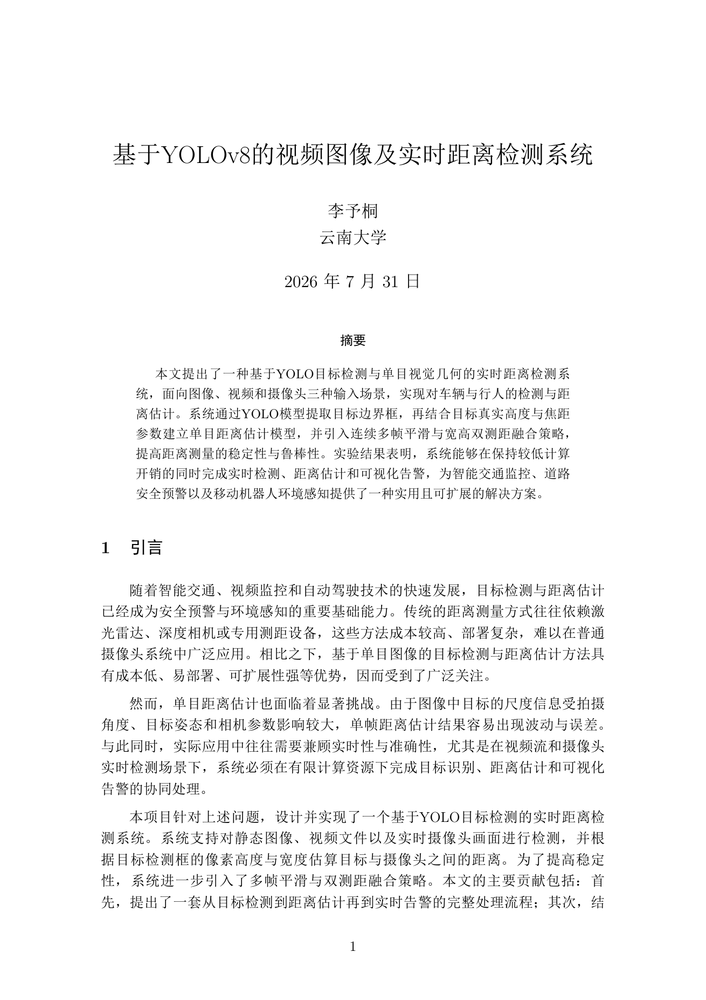

009 · B1 单目测距

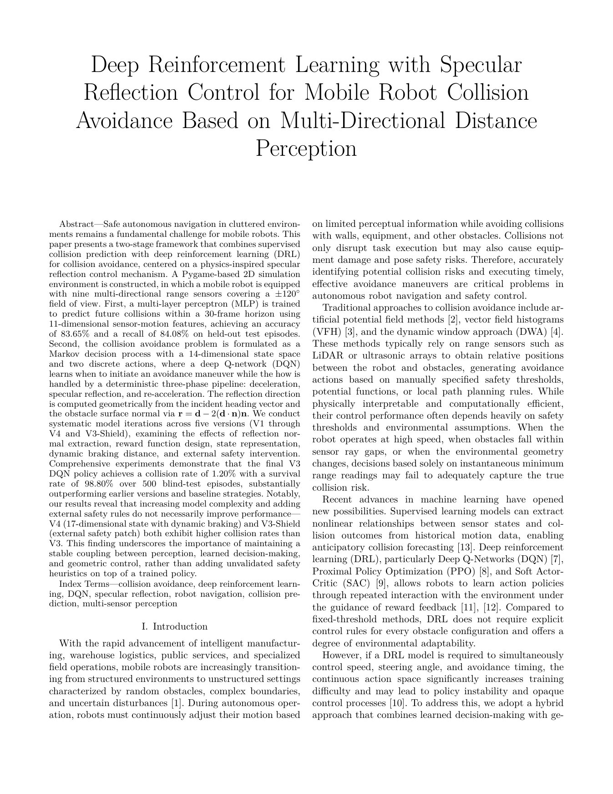

007 · B2 碰撞预测

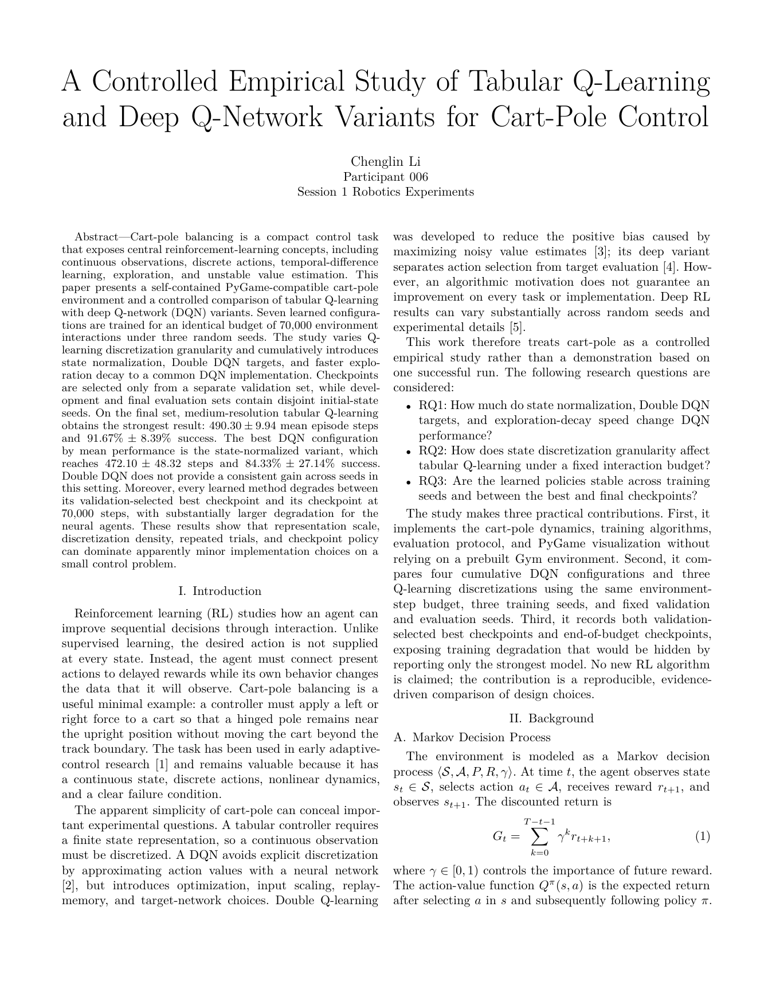

006 · B3 CartPole

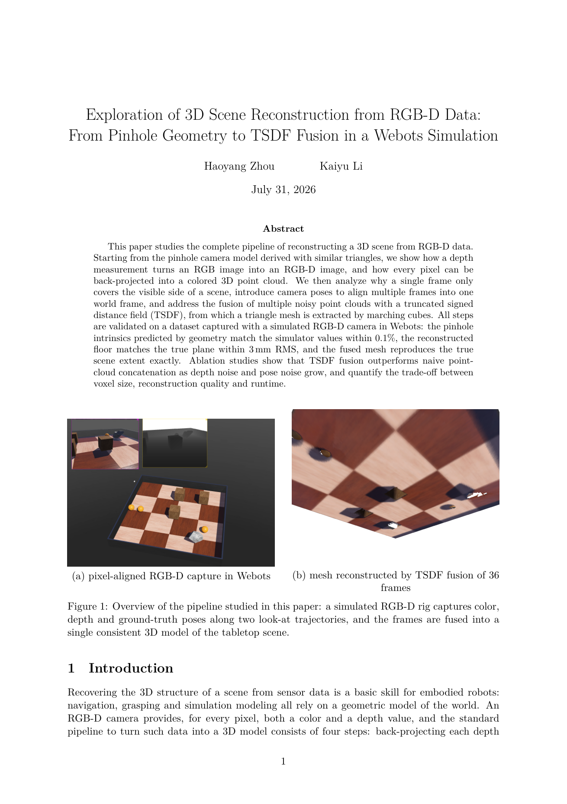

001 · B4 三维重建

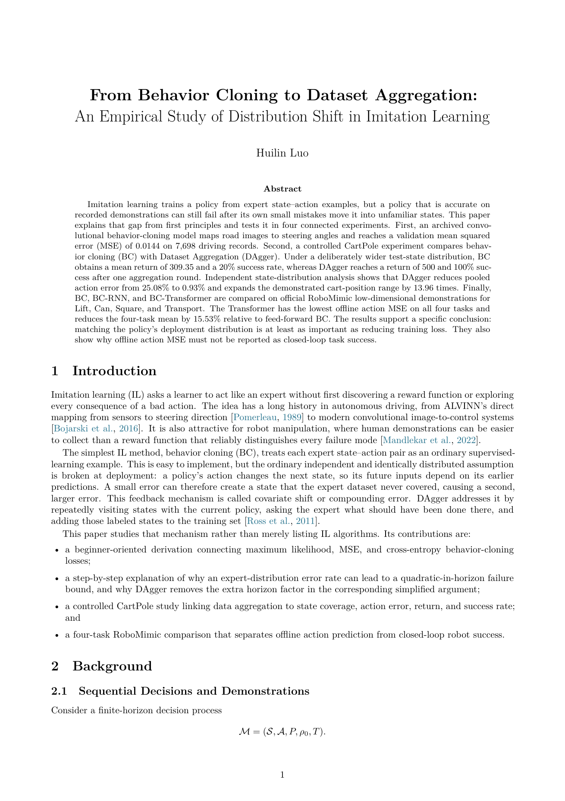

004 · B5 模仿学习

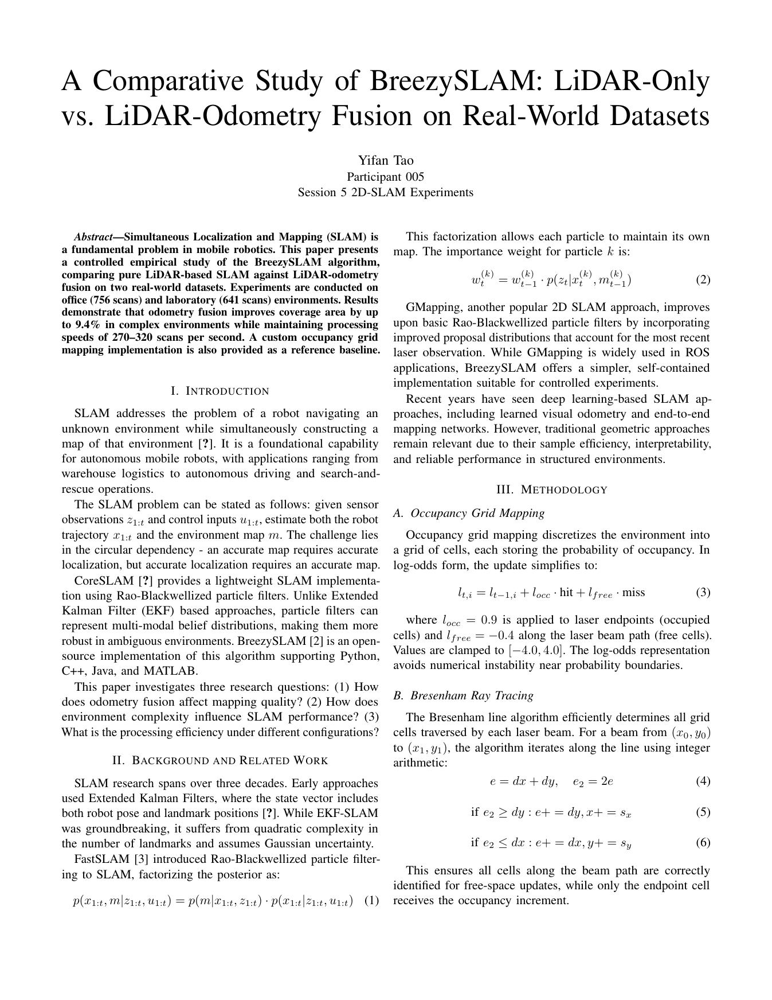

005 · B6 2D-SLAM

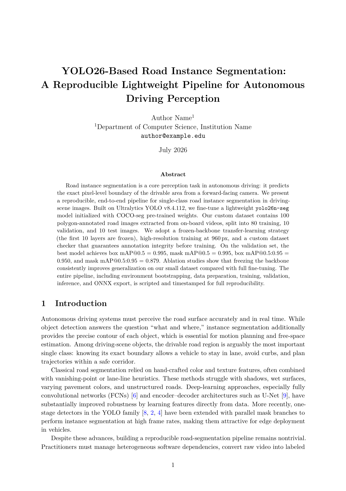

003 · B7 道路分割

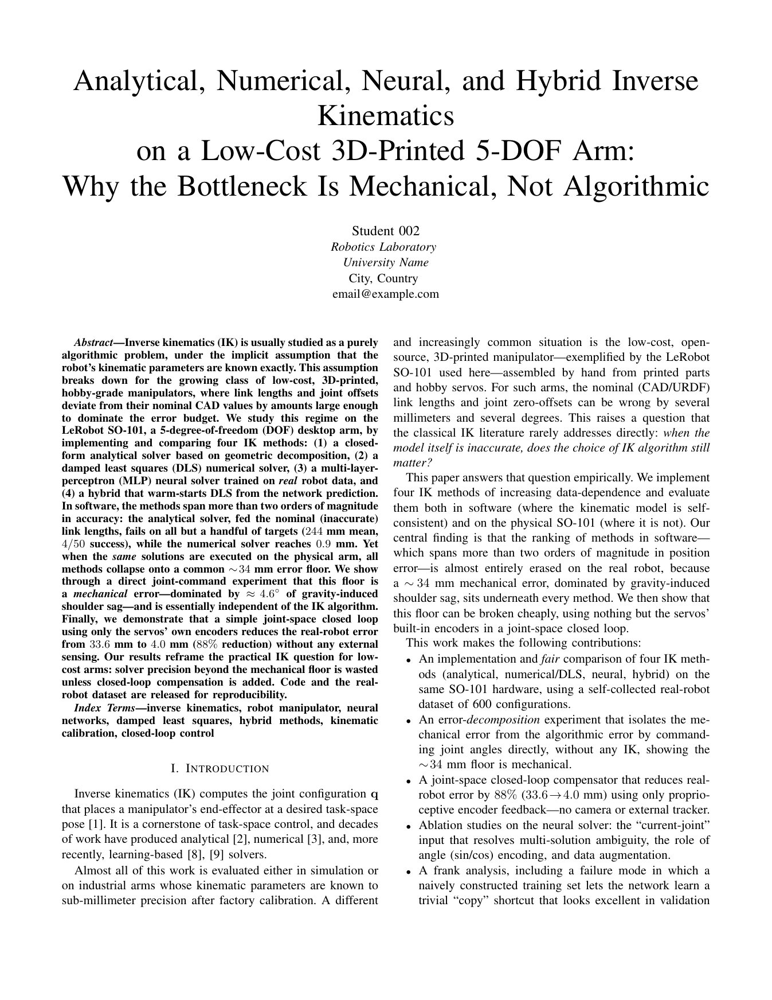

002 · B9 机械臂 IK

---
layout: center
class: text-center
transition: slide-left
title: "Part 02 · A2 进阶实战"
---

PART 02

A2 进阶实战

VOA（Vision-Other-Action）强化学习防碰撞线控底盘

001 硬件侧 · 003 算法侧 · 009 模型侧

---
transition: slide-up
title: "A2 系统架构"
---

A2 ｜ 三方协作架构：仿真与真机同一协议

001 硬件侧（Webots 仿真 / 真机 env server）⇄ WebSocket ⇄ 003 算法侧（SAC client）⇄ 进程内 import ⇄ 009 模型侧（网络定义）· 协议 v1.1 唯一权威定义

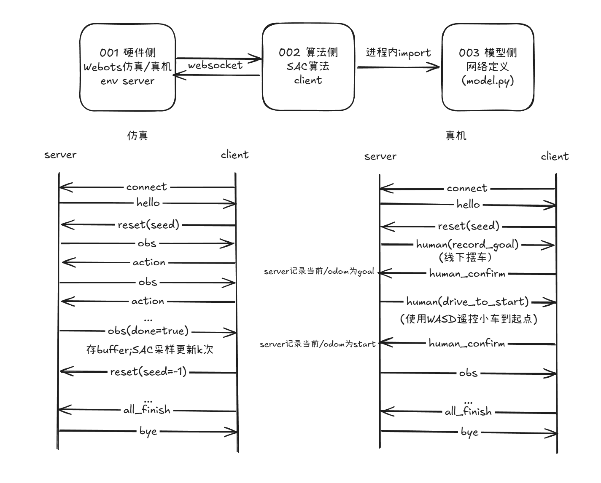

---
transition: slide-up
title: "A2 演示"
---

A2 ｜ 演示：从仿真训练到真机运行

SAC 策略驱动线控底盘绕障到点；真机阶段支持人工摆车与遥控介入（human-in-the-loop）

<video src="./assets/videos/A2.mp4" autoplay muted loop playsinline controls style="width: 100%; max-height: 430px; object-fit: contain; border: 1px solid #e5e7eb; border-radius: 10px; background: #000;"></video>

---
transition: slide-up
title: "团队协作"
---

团队协作：分支开发 · PR 评审 · 合并主线

main + 001–010 共 11 个分支 · main 禁止强制 push · 每个 PR 至少一名他人审核通过后方可合并

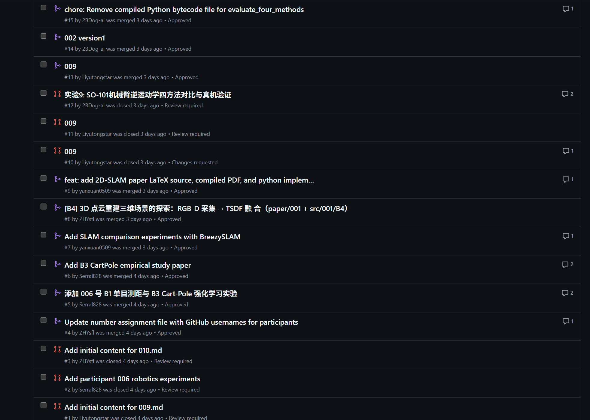

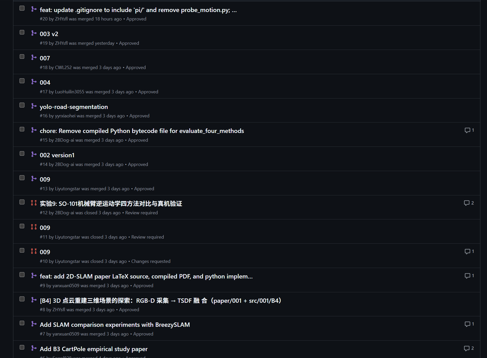

---
transition: fade
class: text-center
title: "谢谢聆听"
---

# 谢谢聆听

九个基础实验连成闭环，A2 把闭环送上真机

恳请各位批评指正 · Q & A

