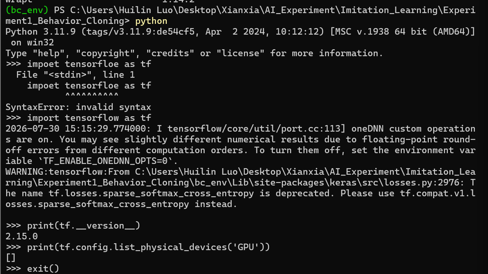
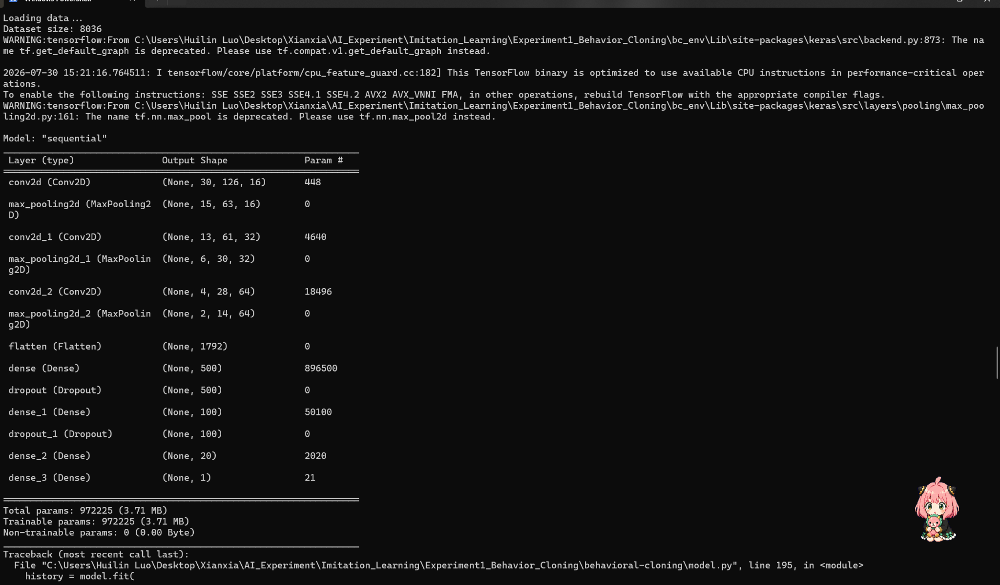
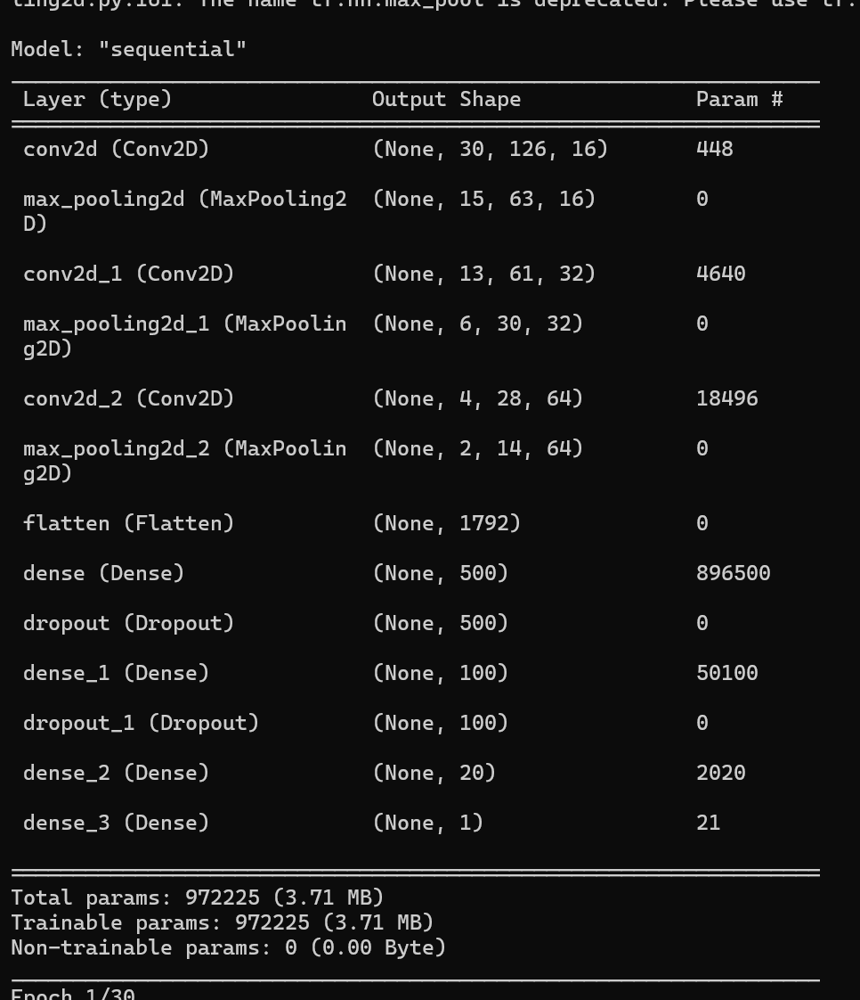
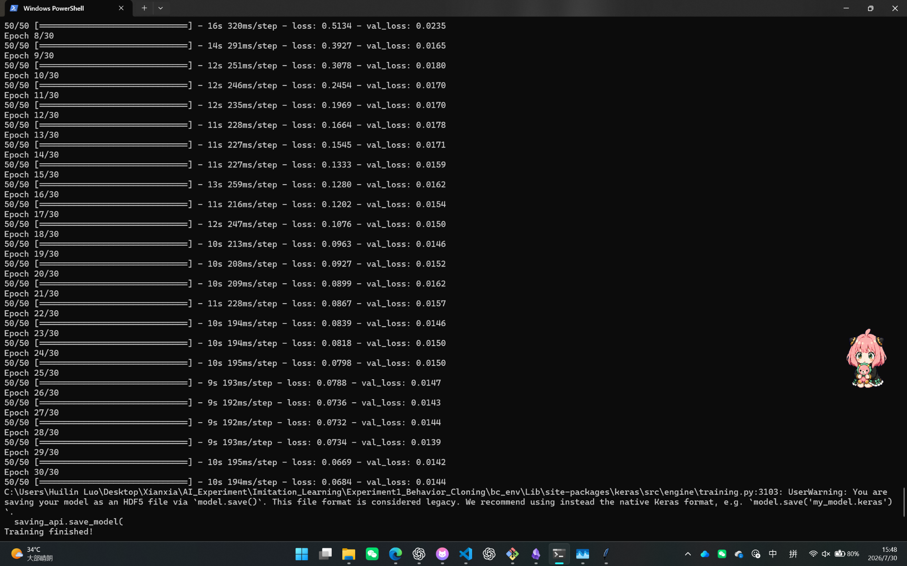
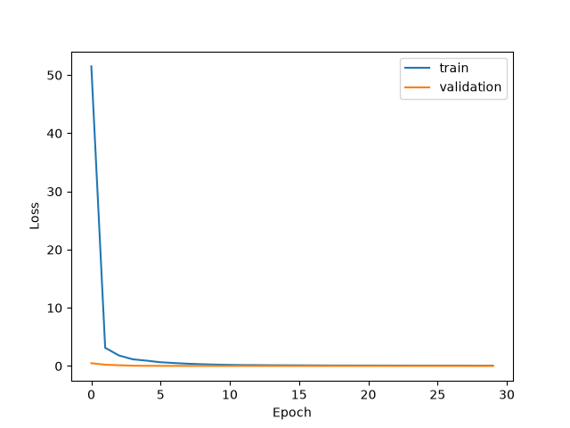

# 实验5：模仿学习（Imitation Learning, IL）的探索实验报告

---

# 一、实验名称

**模仿学习（IL）的探索与行为克隆实验**

---

# 二、实验目的

本实验旨在了解模仿学习（Imitation Learning, IL）的基本原理，并通过实验掌握基于行为克隆（Behavior Cloning）的智能体学习方法。

具体目标如下：

1. 理解模仿学习的基本思想以及与强化学习的区别；
2. 掌握利用专家示范数据训练智能体的方法；
3. 使用传统机器学习方法实现简单行为克隆；
4. 使用 PyTorch 神经网络实现深度模仿学习；
5. 通过 Loss 曲线分析模型训练过程；
6. 构建简单机器人控制环境，验证模仿学习在实际任务中的应用；
7. 分析模仿学习存在的问题和不足。

---

# 三、实验环境

| 环境       | 配置                 |
| -------- | ------------------ |
| 操作系统     | Windows            |
| 编程语言     | Python             |
| 开发工具     | Visual Studio Code |
| Python版本 | Python 3.x         |
| 机器学习库    | Scikit-learn       |
| 深度学习框架   | PyTorch            |
| 数据处理库    | NumPy              |
| 可视化工具    | Matplotlib         |

---

# 四、实验原理

## 4.1 模仿学习基本概念

模仿学习（Imitation Learning）是一种通过学习专家示范数据，使智能体获得类似专家行为能力的方法。

传统强化学习通常需要智能体不断与环境交互，通过奖励函数不断优化策略，而模仿学习直接利用专家提供的行为数据进行训练，可以减少大量探索过程。

模仿学习的基本流程如下：

```
专家执行任务

↓

采集状态-动作数据

↓

训练模型

↓

智能体预测动作

↓

完成任务
```

例如自动驾驶场景中：

专家驾驶车辆时：

```
道路状态 → 转向动作
```

模型学习后：

```
道路状态 → AI预测动作
```

---

## 4.2 模仿学习与强化学习区别

|      | 强化学习     | 模仿学习   |
| ---- | -------- | ------ |
| 学习方式 | 自主探索环境   | 学习专家示范 |
| 数据来源 | 环境反馈     | 专家数据   |
| 优化目标 | 最大化奖励    | 接近专家策略 |
| 优点   | 可能发现新的策略 | 训练效率较高 |
| 缺点   | 训练成本高    | 依赖专家数据 |

---

## 4.3 行为克隆方法

本实验主要采用行为克隆（Behavior Cloning）方法。

行为克隆将模仿学习转换为监督学习问题。

训练数据形式：

>(s,a)

其中：

* s 表示环境状态；
* a 表示专家采取的动作。

模型通过学习：

>状态 -> 动作

实现对专家行为的模拟。

例如：

输入：

```
机器人当前位置
```

输出：

```
向左移动 / 向右移动
```

---

# 五、实验内容

本实验共设计四个实验：

1. 基础行为克隆实验；
2. 基于 PyTorch 神经网络的模仿学习实验；
3. 模型训练 Loss 曲线分析实验；
4. 简单机器人环境控制实验。

整体实验流程：

```
专家数据生成

↓

行为克隆训练

↓

神经网络优化

↓

训练过程分析

↓

机器人任务验证
```

---

# 六、实验一：基于CNN的自动驾驶行为克隆实验


## 6.1 实验目的

本实验通过行为克隆（Behavior Cloning）方法，实现基于专家驾驶数据的自动驾驶模型训练。

实验目标：

1. 理解模仿学习中专家数据驱动的基本思想；
2. 掌握行为克隆将模仿学习转换为监督学习的方法；
3. 使用卷积神经网络（CNN）实现图像到驾驶动作的预测；
4. 分析模型训练过程以及Loss变化。


---

## 6.2 实验环境


| 环境 | 配置 |
| ---- | ---- |
| 操作系统 | Windows |
| 编程语言 | Python 3.11.9 |
| 深度学习框架 | TensorFlow 2.15.0 |
| 数据处理库 | NumPy、Pandas |
| 可视化工具 | Matplotlib |


实验环境验证结果：




---

## 6.3 数据集介绍


本实验采用 Udacity Self-Driving Car 数据集。

数据集主要包含：

- 车辆前方摄像头采集的道路图像；
- 对应驾驶过程中的方向盘控制数据；
- 图像与驾驶行为之间的对应关系。


数据加载结果：




---

## 6.4 行为克隆模型设计


行为克隆的核心思想是利用专家示范数据训练模型，使模型学习专家的驾驶策略。


训练数据形式：

```
输入：车辆图像

输出：方向盘转角
```


模型结构：

```
输入图像

↓

CNN卷积层

↓

池化层

↓

Flatten层

↓

全连接层

↓

输出方向盘角度
```


CNN网络结构能够自动提取道路图像中的视觉特征，并根据特征预测车辆控制动作。


模型结构如下：




模型参数：

- 总参数量：972225
- 可训练参数：972225


---

## 6.5 模型训练


训练过程中采用监督学习方式。


训练参数如下：


| 参数 | 设置 |
| ---- | ---- |
| Epoch | 30 |
| Batch Size | 160 |
| 优化器 | Adam |
| 损失函数 | MSE |


模型训练过程：




---

## 6.6 实验结果分析


训练完成后，模型得到如下结果：


```
loss = 0.0684

validation loss = 0.0144
```


Loss变化曲线如下：





从训练结果可以看出：

1. 模型训练初期Loss较高，随着训练次数增加快速下降；
2. 训练后期Loss趋于稳定，说明模型逐渐学习到了驾驶数据中的规律；
3. 验证集Loss保持较低水平，说明模型具有较好的泛化能力。


---

## 6.7 实验总结


本实验利用专家驾驶数据训练CNN模型，实现了基于图像输入的驾驶行为预测。

实验结果表明：

1. 行为克隆能够利用专家示范数据学习控制策略；
2. CNN网络能够有效提取图像特征并完成驾驶动作预测；
3. 通过Loss曲线可以观察模型学习过程，验证训练有效性。


同时，本实验也体现了模仿学习存在的问题：

- 模型依赖专家数据质量；
- 当实际状态偏离训练数据分布时，可能产生预测误差。


---

# 七、实验二：基于 PyTorch 神经网络的模仿学习

## 7.1 实验目的

传统机器学习模型表达能力有限，因此进一步使用神经网络实现模仿学习。

---

## 7.2 实验方法

构建一个简单策略网络：

```
输入层

↓

隐藏层

↓

隐藏层

↓

输出层
```

网络输入：

```
环境状态
```

网络输出：

```
预测动作
```

训练目标：

使模型预测结果接近专家动作。

---

## 7.3 实验过程

实验使用 PyTorch 构建神经网络，通过不断优化模型参数，使预测结果逐渐接近专家示范。

训练过程：

```
输入状态

↓

神经网络计算

↓

预测动作

↓

计算误差

↓

更新参数
```

---

## 7.4 实验结果

训练完成后，模型能够根据输入状态预测正确动作。

例如：

| 输入状态 | 预测动作 |
| ---- | ---- |
| -5   | 向左   |
| 5    | 向右   |

实验结果说明：

神经网络能够有效学习专家行为策略。

（此处插入：PyTorch训练结果截图）

---

# 八、实验三：Loss训练曲线分析

## 8.1 实验目的

通过观察模型训练过程中的 Loss 变化，分析神经网络学习效果。

---

## 8.2 实验方法

训练过程中记录每轮训练产生的损失值：

[
Loss
]

Loss表示模型预测结果与真实专家动作之间的差异。

---

## 8.3 实验结果

训练初期：

模型参数随机，预测误差较大。

随着训练次数增加：

```
Loss逐渐下降
```

说明模型不断调整参数，逐渐学习专家策略。

（此处插入：Loss曲线图片）

---

## 8.4 结果分析

通过 Loss 曲线可以发现：

1. 模型在训练过程中不断优化；
2. 损失值降低表示预测结果更加接近专家行为；
3. 神经网络能够有效完成模仿任务。

---

# 九、实验四：简单机器人环境模拟

## 9.1 实验目的

为了验证模仿学习在控制任务中的应用，设计简单机器人移动环境。

---

## 9.2 环境设计

建立一维机器人环境：

```
起点 ---------------- 目标点
机器人                  10
```

机器人状态：

```
当前位置
```

机器人动作：

```
0：向左移动

1：向右移动
```

---

## 9.3 专家策略设计

专家控制规则：

当：

```
当前位置 < 目标位置
```

执行：

```
向右移动
```

否则：

```
向左移动
```

通过该规则生成专家示范数据。

---

## 9.4 实验过程

训练完成后的模型代替专家控制机器人。

控制流程：

```
机器人当前位置

↓

神经网络预测动作

↓

机器人移动

↓

更新状态
```

---

## 9.5 实验结果

实验结果显示：

机器人能够根据当前位置选择移动方向，并逐渐接近目标位置。

说明：

经过训练的模型能够完成简单控制任务。

（此处插入：机器人运行截图）

---

# 十、实验结果分析

通过四个实验，可以得到以下结论：

## 1. 行为克隆实验

证明：

模仿学习可以通过专家数据学习行为规律。

---

## 2. 神经网络实验

证明：

深度神经网络具有更强的特征学习能力，可以完成更加复杂的行为预测。

---

## 3. Loss分析实验

证明：

随着训练进行，模型误差不断降低，学习过程有效。

---

## 4. 机器人实验

证明：

模仿学习不仅可以预测动作，也可以用于简单智能体控制任务。

---

# 十一、模仿学习存在的问题

## 11.1 分布偏移问题

这是模仿学习最主要的问题。

模型训练时：

```
专家产生的数据
```

实际运行时：

```
AI自身产生的数据
```

二者可能存在差异。

例如自动驾驶：

训练：

```
车辆保持道路中央
```

实际：

```
车辆偏离道路
```

由于模型没有学习过异常状态，可能产生错误。

---

## 11.2 依赖大量专家数据

模仿学习需要大量、高质量专家示范。

例如自动驾驶系统需要大量真实驾驶数据。

数据采集成本较高。

---

## 11.3 难以超过专家

模仿学习目标是复制专家策略。

因此：

如果专家存在不足，模型也可能继承这些问题。

---

# 十二、实验总结

本实验对模仿学习进行了探索。

首先，通过基础行为克隆实验验证了利用专家数据学习行为的方法；随后使用 PyTorch 神经网络进一步提升模型学习能力，并通过 Loss 曲线分析模型训练过程。

最后，通过简单机器人环境验证了模仿学习在控制任务中的应用。

实验结果表明：

* 模仿学习能够有效利用专家经验；
* 行为克隆是一种简单有效的方法；
* 深度神经网络可以提升模仿能力。

但是模仿学习仍存在：

* 分布偏移；
* 专家数据依赖；
* 难以超越专家

等问题。

未来可以结合强化学习、逆强化学习等方法，提高智能体自主学习能力。

---

# 十三、实验附件说明

提交文件建议：

```
IL_Experiment

├── code
│
├── 01_behavior_cloning.py
│
├── 02_pytorch_IL.py
│
├── 03_loss_curve.py
│
├── 04_robot_environment.py
│
├── result
│
├── loss_curve.png
│
├── training_result.png
│
└── robot_result.png
```

---

这个版本就是最终提交版结构。

后面实际做实验时，只需要：

1. 跑四个代码；
2. 把三个结果截图补进去；
3. 修改实验结果部分对应内容。

这样报告和代码是对应的。
