# 实验5：模仿学习（IL）的探索——从行为克隆、DAgger 到机器人操作

> 本文件是 `reports.md` 的四实验整合副本，未覆盖原文件。实验一对已完成的源码、CNN 模型和 Loss 曲线进行归档验证；实验二、三、四均在本机实际运行。文中数值统一来自对应 `results/*.json`，不是示例数据。

---

# 一、实验目的

1. 理解行为克隆（Behavior Cloning，BC）和 DAgger 的基本原理；
2. 掌握从专家状态—动作示范训练策略的方法；
3. 复现基于 CNN 的自动驾驶行为克隆流程；
4. 在 CartPole 中观察行为克隆的分布偏移，并用 DAgger 缓解；
5. 通过学习曲线、β 衰减消融、动作误差和状态分布解释性能变化；
6. 使用 RoboMimic 官方数据完成 Lift、Can、Square、Transport 四任务实验；
7. 比较 BC、BC-RNN、BC-Transformer 的精度与计算开销。

---

# 二、实验原理

## 2.1 行为克隆

给定专家数据集

$$
\mathcal{D}_E=\{(s_i,a_i)\}_{i=1}^{N},
$$

行为克隆把策略学习转化为监督学习：

$$
\theta^\*=\arg\min_\theta
\mathbb{E}_{(s,a)\sim\mathcal{D}_E}
\left[\mathcal{L}(\pi_\theta(s),a)\right].
$$

连续动作通常使用均方误差，离散动作使用交叉熵。BC 简单稳定，但训练样本来自专家分布，部署时状态来自学习器自身分布，二者不一致时会产生复合误差。

## 2.2 DAgger

DAgger 在第 $i$ 轮让当前策略与环境交互，在访问状态上查询专家动作并聚合数据：

$$
\mathcal{D}_{i+1}
=
\mathcal{D}_{i}
\cup
\{(s,\pi_E(s)):s\sim d_{\pi_i}\}.
$$

采集策略采用专家和学习器的混合动作：

$$
\pi_i^{mix}=\beta_i\pi_E+(1-\beta_i)\pi_i,
\qquad
\beta_i=\lambda^i.
$$

本实验主实验取 $\lambda=0.5$，并比较 $\lambda=0.9,0.5,0.1$。训练仍为监督学习，环境奖励只用于评测。

## 2.3 序列行为克隆

普通 BC 使用当前观测预测动作。BC-RNN 和 BC-Transformer 使用最近 $H$ 个观测：

$$
\hat a_t=\pi_\theta(s_{t-H+1:t}).
$$

RNN 通过隐状态压缩历史；Transformer 通过自注意力建模时序依赖。对机器人多阶段操作，历史信息可帮助模型区分外观相似但任务阶段不同的状态。

## 2.4 RoboMimic 数据

RoboMimic 官方 HDF5 数据按轨迹组织，核心结构为：

```text
data/demo_i/obs/*
data/demo_i/actions
data/demo_i/rewards
data/demo_i/dones
mask/train
mask/valid
```

实验四读取官方 v1.5 proficient-human（PH）低维数据，并使用官方 `train`/`valid` 轨迹掩码，避免相邻帧跨集合泄漏。

---

# 三、实验环境与复现范围

| 项目 | 实验一 | 实验二、三 | 实验四 |
| --- | --- | --- | --- |
| 操作系统 | Windows | Windows 11 | Windows 11 |
| Python | 3.11.9 | 3.12.13 | 3.12.13 |
| 主要框架 | TensorFlow 2.15.0 | scikit-learn 1.9.0 | PyTorch 2.12.1 CPU |
| 数值库 | NumPy、Pandas | NumPy 2.3.5 | NumPy 2.3.5、h5py 3.15.1 |
| 随机种子 | 数据划分 42 | 20260730 | 20260730 |

实验一保留了训练源码、`model.h5` 和 Loss 曲线，但原始摄像头数据未随仓库保存。因此四实验入口会验证实验一归档，而不会伪造一次不存在的数据重训。实验二将 CartPole-v1 动力学封装在单文件中。终止条件为小车位置超过 `±2.4`、杆角超过 `±12°` 或达到 500 步。

实验四使用 RoboMimic 官方 HDF5 数据完成离线动作预测基准。由于未安装 robosuite/MuJoCo 仿真栈，本报告不从验证 MSE 推断机器人闭环成功率，也不声称复现官方论文的完整 rollout 分数。

四个实验形成以下递进关系：

| 实验 | 任务 | 核心问题 | 主要证据 |
| --- | --- | --- | --- |
| 实验一 | 图像到转向角 | BC 是否能学习专家映射 | CNN 训练/验证 MSE |
| 实验二 | CartPole 闭环控制 | BC 的分布偏移如何缓解 | 回报、成功率、β 消融 |
| 实验三 | 定量机制分析 | DAgger 为什么有效 | 状态覆盖和动作误差 |
| 实验四 | 官方机器人示范数据 | 方法能否迁移到操作任务 | 四任务三模型离线基准 |

---

# 四、实验一：基于 CNN 的自动驾驶行为克隆

## 4.1 任务与数据

实验一已作为独立模块整合到 `Experiment1_Behavior_Cloning`。它来源于 Udacity 自动驾驶行为克隆项目，输入为车辆前方摄像头图像，输出为连续方向盘转角：

```text
道路图像 -> CNN 特征提取 -> 全连接回归 -> 方向盘角度
```


已完成实验记录包含 7698 条驾驶样本，按固定种子 42 划分为 6158 条训练记录和 1540 条验证记录。每条记录含中心、左、右三个摄像头图像和方向盘角度；训练生成器使用相机选择、方向修正、水平翻转、裁剪和缩放增强。预处理后输入尺寸为 `32 × 128 × 3`。


## 4.2 模型与结果

模型含 3 个卷积层、3 个池化层、Flatten 层及 4 个全连接层，两个 Dropout 比例分别为 0.5 和 0.25，总参数量为 `972225`。连续输出表示方向盘转角。


| 参数 | 数值 |
| --- | ---: |
| Epoch | 30 |
| Batch Size | 128 |
| 优化器 | Adam |
| 学习率 | 0.0001 |
| 损失函数 | MSE |
| 验证集比例 | 20% |
| 数据划分种子 | 42 |

| 指标 | 数值 |
| --- | ---: |
| 原始样本数 | 7698 |
| 训练/验证样本数 | 6158 / 1540 |
| 模型参数量 | 972225 |
| 最终训练 MSE | 0.0684 |
| 最终验证 MSE | 0.0144 |
| 模型文件大小 | 11.73 MB |


集成验证脚本确认训练源码、`model.h5`、Loss 曲线和报告图片均存在，模型 SHA-256 为 `9a9008c58f324609095176c6b21aa55508ea1cdf579495d1734a6485f3c61ba9`。损失曲线说明网络学到了图像到转角的监督映射，但当前归档没有机器可读的模拟器闭环成功率。因此实验一只报告可核验的离线结果，不把原项目演示描述转换成虚构成功率。

---

# 五、实验二：DAgger 交互式模仿学习

## 5.1 实验设置

CartPole 状态为

$$
s=[x,\dot{x},\theta,\dot{\theta}],
$$

动作 `0/1` 分别表示向左、向右施力。初始 BC 数据仅含 2 条窄初态专家轨迹，共 1000 个样本；测试和 DAgger 采集使用更宽的初态分布。策略为两层 `32-32`、`tanh` 激活的 MLP，所有方法使用相同的 80 个测试种子。回合步数不低于 475 记为成功。

## 5.2 BC 基线与 DAgger 学习曲线

| 方法 | 数据量 | 平均回报 | 标准差 | 中位数 | 成功率 |
| --- | ---: | ---: | ---: | ---: | ---: |
| BC | 1000 | 309.35 | 123.63 | 276 | 20% |
| DAgger（第 6 轮） | 30701 | 500.00 | 0.00 | 500 | 100% |
| 专家 | - | 500.00 | 0.00 | 500 | 100% |

主实验每轮采集 10 条轨迹，取 $\beta_i=0.5^i$：

| 轮次 | β | 聚合样本数 | BC 回报 | DAgger 回报 | DAgger 成功率 |
| ---: | ---: | ---: | ---: | ---: | ---: |
| 0 | 1.0000 | 1000 | 309.35 | 309.35 | 20% |
| 1 | 0.5000 | 5701 | 309.35 | 500.00 | 100% |
| 2 | 0.2500 | 10701 | 309.35 | 500.00 | 100% |
| 3 | 0.1250 | 15701 | 309.35 | 500.00 | 100% |
| 4 | 0.0625 | 20701 | 309.35 | 500.00 | 100% |
| 5 | 0.0312 | 25701 | 309.35 | 500.00 | 100% |
| 6 | 0.0156 | 30701 | 309.35 | 500.00 | 100% |

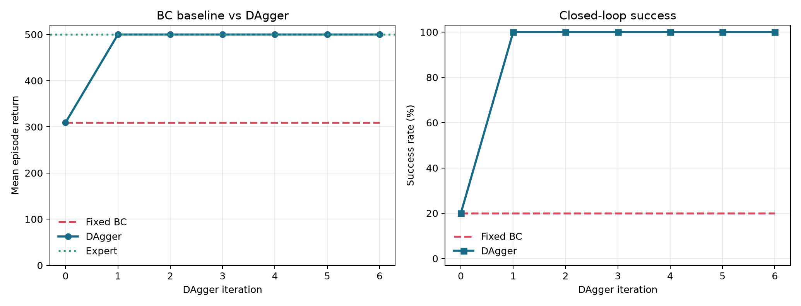

固定 BC 不再接收新状态，因此其曲线保持不变。DAgger 第一轮已标注 BC 容易访问而初始示范缺失的状态，回报和成功率迅速达到专家水平。

## 5.3 β 衰减消融

消融实验固定初始数据、评测种子、网络结构、训练轮数，并对每组每轮采集 3 条轨迹。

| 衰减 λ | 第 1 轮 β | 第 6 轮 β | 最终样本数 | 最终回报 | 最终成功率 |
| ---: | ---: | ---: | ---: | ---: | ---: |
| 0.9 | 0.9 | 0.531441 | 10000 | 500.00 | 100% |
| 0.5 | 0.5 | 0.015625 | 9393 | 500.00 | 100% |
| 0.1 | 0.1 | 0.000001 | 9707 | 500.00 | 100% |

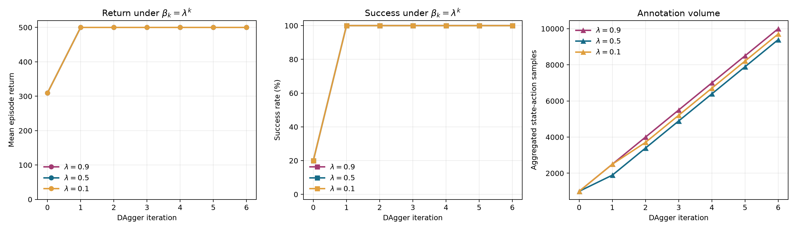

三组设置均在第一轮达到满分，说明在当前确定性 CartPole 和查询预算下，结论对这三种 β 衰减不敏感。该消融不能支持“某一 λ 显著更优”，但支持“一轮策略分布标注已足够解决主要分布偏移”的判断。样本数差异来自不同混合策略下轨迹长度不同。

## 5.4 动作预测误差

另取 40 个独立种子，分别收集专家、BC、DAgger 的访问状态，合并后固定抽取 30000 个状态。动作概率 MSE 定义为

$$
\operatorname{MSE}_a
=
\frac{1}{N}\sum_i
\left(P_\theta(a=1\mid s_i)-\pi_E(s_i)\right)^2.
$$

| 策略 | 动作概率 MSE | 动作错误率 | 二元交叉熵 |
| --- | ---: | ---: | ---: |
| BC | 0.221315 | 25.077% | 1.358322 |
| DAgger | 0.006405 | 0.927% | 0.020764 |

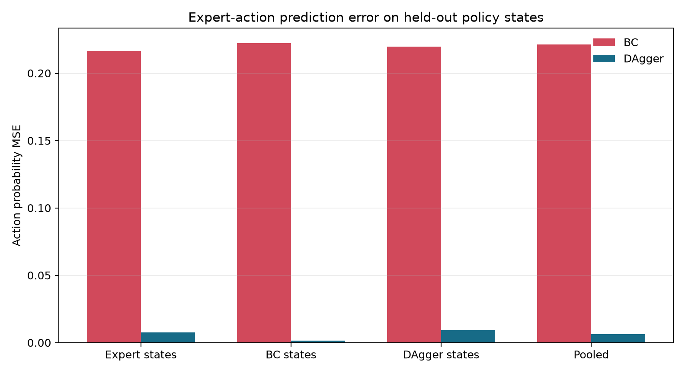

DAgger 的动作概率 MSE 相比 BC 下降 `97.11%`，动作错误率下降 `24.15` 个百分点。这一结果直接说明性能提升来自学习器访问状态上的专家动作拟合改善。

## 5.5 状态覆盖与闭环轨迹

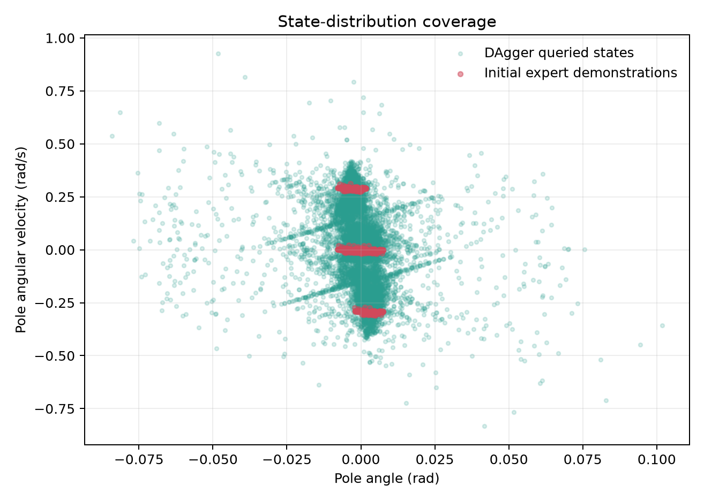

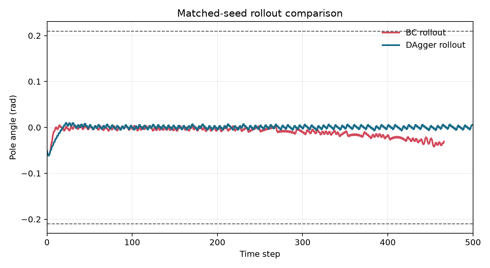

DAgger 相比 BC 的平均回报增加 `190.65`，成功率提高 `80` 个百分点。结果支持核心结论：聚合学习器自身状态上的专家标签能够缓解行为克隆的分布偏移。

---

# 六、实验三：性能与误差分析

## 6.1 分析方法

分析脚本读取：

- 实验一 `Experiment1_Behavior_Cloning/results/metrics.json`；
- 实验二 `metrics.json`、`state_coverage.npz` 和 `policy_state_distributions.npz`；
- 实验四 `official_benchmark_metrics.json`。

状态覆盖使用第 1 至第 99 百分位跨度，降低离群点影响。不同任务的动作维度和数据分布不同，因此实验四只在同一任务内比较模型，不把 MSE 直接当作任务难度。

## 6.2 综合结果

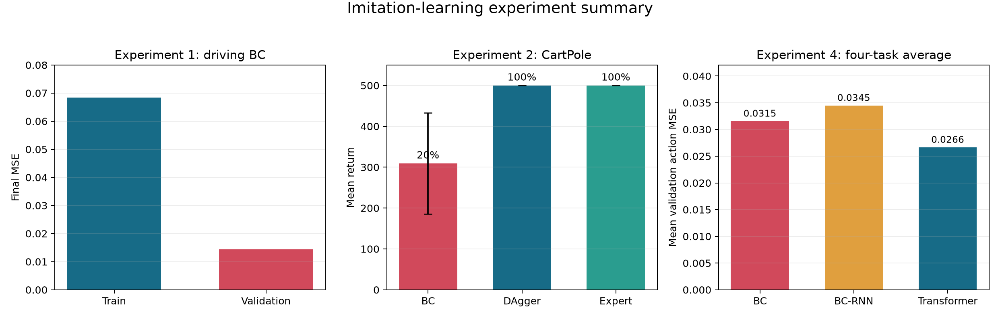

实验一说明图像到连续动作的监督映射能够收敛；实验二说明闭环指标需要与离线误差联合解释；实验四则把模型比较扩展到官方机器人示范数据。

## 6.3 状态覆盖增益

| 状态维度 | 初始 1%–99% 跨度 | 聚合后跨度 | 扩大倍数 |
| --- | ---: | ---: | ---: |
| 小车位置 $x$ | 0.2731 | 3.8118 | 13.96× |
| 小车速度 $\dot{x}$ | 0.4197 | 1.2885 | 3.07× |
| 杆角 $\theta$ | 0.01476 | 0.09991 | 6.77× |
| 杆角速度 $\dot{\theta}$ | 0.6003 | 0.7906 | 1.32× |

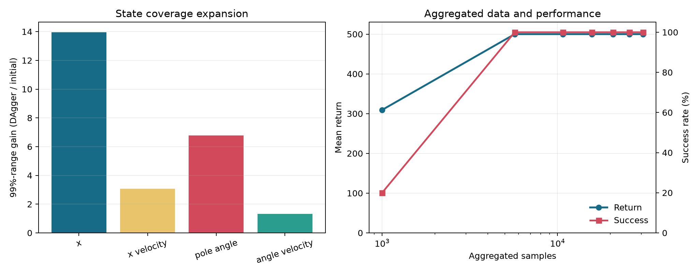

## 6.4 二维状态分布

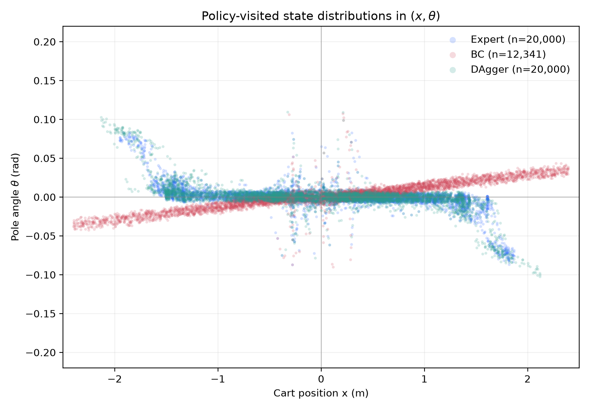

图中蓝色为专家、红色为 BC、绿色为 DAgger。BC 的小车位置 1%–99% 区间为 `[-2.260, 2.297]`，已接近 `±2.4` 终止边界；DAgger 为 `[-1.867, 1.765]`，与专家 `[-1.741, 1.770]` 更接近。BC 的红色斜带说明杆角虽小，但小车位置持续漂移，最终仍可能失败。

## 6.5 误差分解

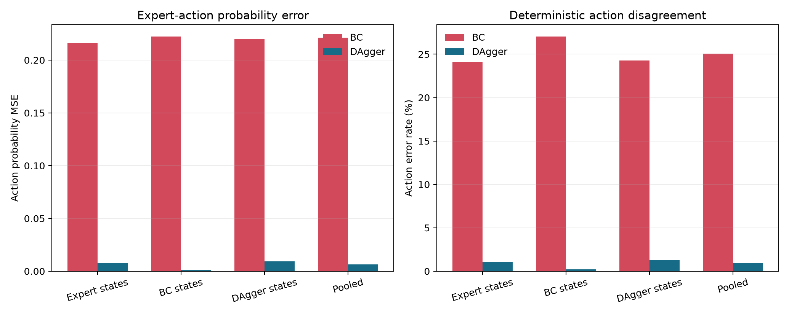

无论在专家、BC 还是 DAgger 访问状态上，DAgger 的动作概率 MSE 和动作错误率均明显低于 BC。由此形成完整因果证据链：

```text
策略访问状态被聚合
-> 状态覆盖扩大
-> 学习器分布上的动作误差下降
-> 闭环回报和成功率提高
```

---

# 七、实验四：基于 RoboMimic 官方数据的低维机器人模仿学习

## 7.1 数据来源与校验

数据来自官方 `robomimic/robomimic_datasets` v1.5，选择 PH low-dimensional 版本：

| 任务 | 环境 | 轨迹数 | 总样本数 | 观测维度 | 动作维度 | 文件大小 |
| --- | --- | ---: | ---: | ---: | ---: | ---: |
| Lift | Lift | 200 | 9666 | 19 | 7 | 21.1 MB |
| Can | PickPlaceCan | 200 | 23207 | 23 | 7 | 46.9 MB |
| Square | NutAssemblySquare | 200 | 30154 | 23 | 7 | 51.1 MB |
| Transport | TwoArmTransport | 200 | 93752 | 59 | 14 | 303.2 MB |

每个文件均通过 SHA-256 校验，摘要记录在 `data/official/dataset_manifest.json`。每项任务使用官方掩码划分的 180 条训练轨迹和 20 条验证轨迹。

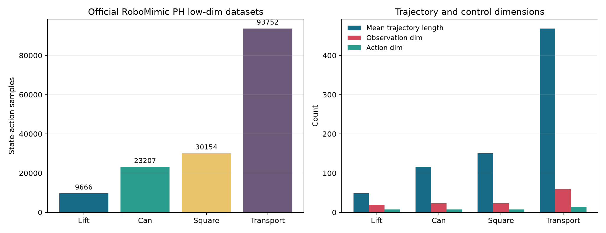

## 7.2 模型与统一训练设置

| 模型 | 结构 |
| --- | --- |
| BC | 当前观测，`256-256` MLP，ReLU，tanh 动作头 |
| BC-RNN | 128 维输入投影，单层 128 维 LSTM，128 维动作头 |
| BC-Transformer | 上下文长度 10，2 层、128 维、4 头 Transformer |

统一训练条件：

| 参数 | 数值 |
| --- | ---: |
| 优化器 | AdamW |
| 学习率 | 0.0003 |
| 权重衰减 | 0.0001 |
| Batch Size | 512 |
| 最大 Epoch | 12 |
| Early Stopping Patience | 4 |
| 最大训练窗口 | 60000 |
| 最大验证窗口 | 20000 |
| Bootstrap 重复次数 | 2000 |

观测归一化参数仅由训练轨迹计算。Lift、Can、Square 使用全部可用训练窗口；Transport 训练窗口固定抽样到 60000，以限制计算量。三类模型在同一数据划分和训练预算下比较。

## 7.3 训练曲线

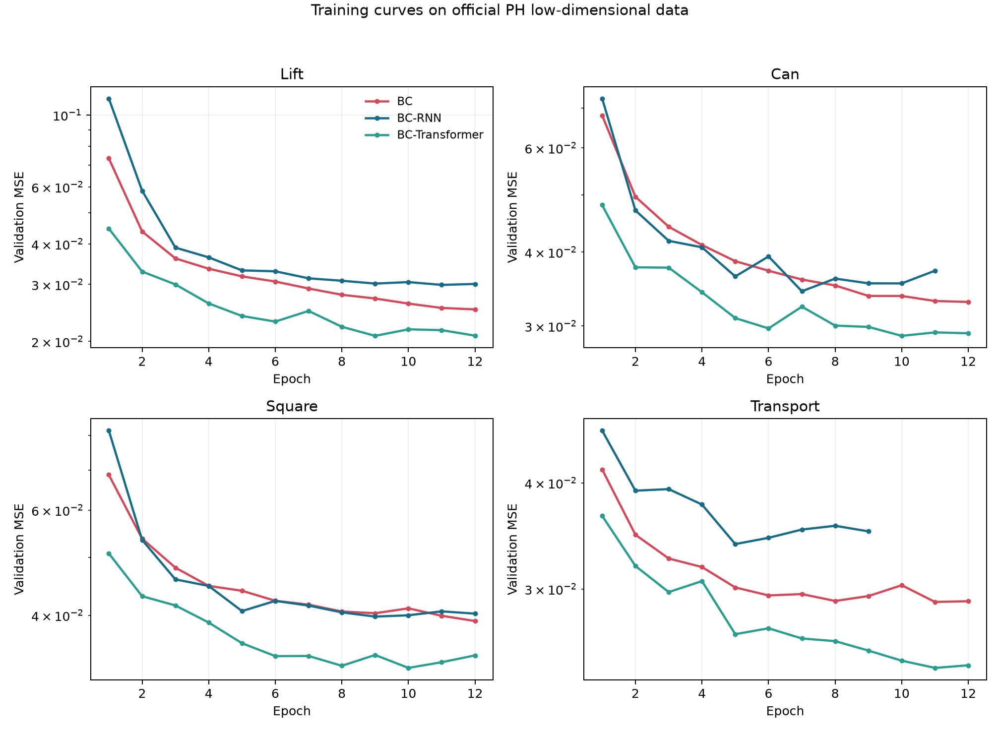

Transformer 在四个任务上均较快达到更低的验证 MSE。BC-RNN 在当前 12 epoch 紧凑预算下未超过普通 BC，说明引入序列模型并不自动保证提升，模型容量、优化预算和任务时序结构需要共同考虑。

## 7.4 离线动作预测结果

以下为逐样本、逐动作维度平均的验证 MSE，越低越好：

| 任务 | BC | BC-RNN | BC-Transformer | Transformer 相对 BC |
| --- | ---: | ---: | ---: | ---: |
| Lift | 0.02512 | 0.02989 | **0.02081** | -17.15% |
| Can | 0.03294 | 0.03434 | **0.02887** | -12.36% |
| Square | 0.03912 | 0.03980 | **0.03265** | -16.53% |
| Transport | 0.02896 | 0.03388 | **0.02422** | -16.36% |
| 四任务平均 | 0.03154 | 0.03448 | **0.02664** | -15.53% |

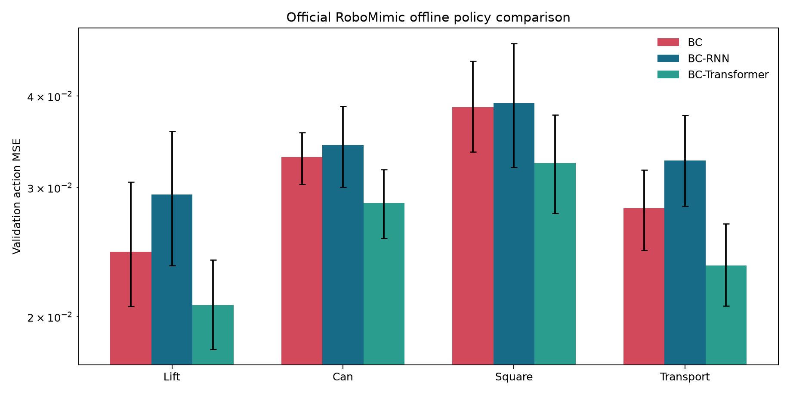

Transformer 在四项任务上均取得最低 MSE，四任务平均比 BC 低 `15.53%`。脚本还按验证轨迹计算 MSE，并用 2000 次 bootstrap 给出 95% 置信区间，完整值保存在 `official_benchmark_metrics.json`。

## 7.5 动作分量与阶段误差

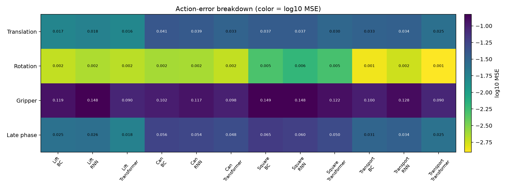

热力图分别给出平移、旋转、夹爪和轨迹后期的 MSE。夹爪维度通常是误差较大的动作分量；Transformer 的优势不仅体现在总 MSE，也体现在多数任务的末期动作预测上。

## 7.6 模型规模与推理开销

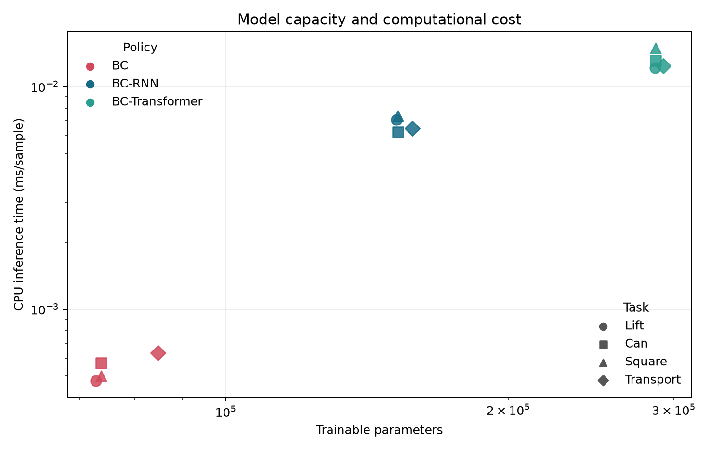

普通 BC 约 `7.3–8.5 万` 参数，BC-RNN 约 `15.2–15.8 万`，Transformer 约 `28.6–29.2 万`。Transformer 精度最佳，但 CPU 单样本推理耗时也最高。因此，实时部署时需要在精度、延迟和硬件之间权衡。

## 7.7 实验边界

本实验相较旧的本地几何 PickPlace 版本有三项实质改进：

1. 使用官方 RoboMimic 四任务 HDF5，而非自生成数据；
2. 使用官方训练/验证轨迹掩码并校验文件哈希；
3. 同时比较 BC、BC-RNN、BC-Transformer。

但这仍是离线动作预测比较。论文中应表述为“在官方 RoboMimic PH 低维数据上的受控离线基准”，不能写成“复现官方闭环成功率”。完整官方 benchmark 仍需 robosuite、MuJoCo、官方配置、多随机种子和仿真 rollout。

---

# 八、模仿学习缺陷与综合讨论

## 8.1 主要结论

1. 实验一将 7698 条驾驶记录训练为 972225 参数的 CNN，完成图像到连续转向角的行为克隆；
2. 普通 BC 在未覆盖状态上会出现复合误差，离线损失不能替代闭环评测；
3. DAgger 将 CartPole 成功率从 `20%` 提升到 `100%`；
4. DAgger 将独立状态池上的动作概率 MSE 从 `0.2213` 降至 `0.0064`；
5. DAgger 在小车位置维度把状态覆盖扩大 `13.96×`；
6. 官方 RoboMimic 四任务中，紧凑 BC-Transformer 的平均 MSE 比 BC 低 `15.53%`；
7. BC-RNN 在有限训练预算下弱于 BC，说明模型复杂度不是性能保证。

## 8.2 局限性

- 实验一原始摄像头数据未随仓库保存；集成入口只能验证已完成源码、模型和结果，不能重训；
- 实验二专家为确定性启发式策略，未加入观测噪声、执行延迟和多随机种子训练；
- β 消融在第一轮后全部饱和，不能区分三种衰减的显著性；
- 实验四每个模型仅训练一个固定种子，bootstrap 只反映验证轨迹抽样不确定性；
- 实验四 Transformer 是适合本机复现的紧凑配置，不等同于官方默认大模型；
- 实验四未运行 MuJoCo 闭环 rollout，因此不报告任务成功率。

## 8.3 可继续扩展的论文实验

1. 对实验二增加噪声、延迟或更少的单轮查询预算，使 β 消融更有区分度；
2. 对实验四运行 3–5 个训练种子，报告均值和标准差；
3. 安装 robosuite/MuJoCo，补充 Lift、Can、Square、Transport 的闭环成功率；
4. 使用官方默认 BC-RNN 和 BC-Transformer 配置，比较紧凑模型与标准模型。

---

# 九、复现方法

在项目根目录执行：

```powershell
.\run_all_experiments.ps1
```

该入口先验证实验一归档，再训练实验二和实验四，最后运行实验三综合分析。

若实验四 `.deps` 不存在，先执行：

```powershell
.\Experiment4_RoboMimic\setup_official_benchmark.ps1
```

若官方 HDF5 文件不存在，执行：

```powershell
python Experiment4_RoboMimic\download_official_datasets.py
```

快速烟雾测试：

```powershell
.\run_all_experiments.ps1 -Quick
```

主要产物：

```text
Experiment1_Behavior_Cloning/
  verify_experiment.py
  behavioral-cloning/model.py
  behavioral-cloning/model.h5
  results/metrics.json
  results/loss_curve.png

Experiment2_DAgger/
  dagger_cartpole.py
  results/metrics.json
  results/policy_state_distributions.npz

Experiment3_Performance_Analysis/
  analyze_experiments.py
  results/analysis_summary.json

Experiment4_RoboMimic/
  official_benchmark.py
  download_official_datasets.py
  data/official/*.hdf5
  results/official_benchmark_metrics.json
  results/official_checkpoints/*.pt

images/
  exp1_*.png
  exp2_*.png
  exp3_*.png
  exp4_official_*.png
```

完整环境和文件说明见 `REPRODUCTION.md`。

---

# 十、参考资料

1. Udacity Self-Driving Car Simulator: <https://github.com/udacity/self-driving-car-sim>
2. Ross, Gordon, Bagnell, *A Reduction of Imitation Learning and Structured Prediction to No-Regret Online Learning*, AISTATS 2011: <https://proceedings.mlr.press/v15/ross11a.html>
3. Gymnasium CartPole-v1: <https://github.com/Farama-Foundation/Gymnasium/blob/main/gymnasium/envs/classic_control/cartpole.py>
4. RoboMimic GitHub: <https://github.com/ARISE-Initiative/robomimic>
5. RoboMimic 数据集文档: <https://robomimic.github.io/docs/datasets/overview.html>
6. RoboMimic 算法文档: <https://robomimic.github.io/docs/modules/algorithms.html>
7. RoboMimic 官方数据: <https://huggingface.co/datasets/robomimic/robomimic_datasets>
8. RoboMimic Transformer 教程: <https://robomimic.github.io/docs/tutorials/training_transformers.html>
9. Mandlekar et al., *What Matters in Learning from Offline Human Demonstrations for Robot Manipulation*: <https://arxiv.org/abs/2108.03298>
